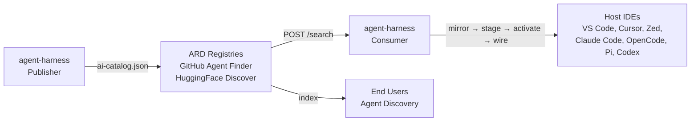

# agent-harness

<p>
  <a href="./LICENSE"></a>
  <a href="./package.json">=23" src="https://img.shields.io/badge/node-%3E%3D23-339933?logo=node.js&logoColor=white" /></a>
  <a href="./package.json"></a>
  <a href="https://github.com/ar27111994/agent-harness/actions/workflows/quality.yml"></a>
  <a href="https://github.com/ar27111994/agent-harness/releases"></a>
  <a href="https://www.npmjs.com/package/@ar27111994/agent-harness"></a>
  <a href="https://www.npmjs.com/package/@ar27111994/agent-harness"></a>
  <a href="#sponsor"></a>
  <a href="https://deepwiki.com/ar27111994/agent-harness"></a>
</p>

<p>
  <strong>Hosts:</strong>
  <a href="#supported-hosts"></a>
  <a href="#supported-hosts"></a>
  <a href="#supported-hosts"></a>
  <a href="#supported-hosts"></a>
  <a href="#supported-hosts"></a>
  <a href="#supported-hosts"></a>
  <a href="#supported-hosts"></a>
</p>

<p>
  <strong>Assets:</strong>
  <a href="#discovery-and-recommendations"></a>
  <a href="#discovery-and-recommendations"></a>
  <a href="#discovery-and-recommendations"></a>
  <a href="#discovery-and-recommendations"></a>
  <a href="#discovery-and-recommendations"></a>
  <a href="#discovery-and-recommendations"></a>
  <a href="#discovery-and-recommendations"></a>
  <a href="#discovery-and-recommendations"></a>
  <a href="#discovery-and-recommendations"></a>
  <a href="#discovery-and-recommendations"></a>
</p>

**Discover anywhere. Install everywhere.**

`agent-harness` is a reviewable supply chain for reusable AI-agent assets: discover trusted sources, rank workspace-specific recommendations, mirror pinned bundles, stage local files, activate host views, and wire everything into the agent host you already use. ARD-compatible (v0.9) as both publisher and consumer.

**Proof points**

- **Published CLI:** [`@ar27111994/agent-harness` on npm](https://www.npmjs.com/package/@ar27111994/agent-harness), with release artifacts on [GitHub Releases](https://github.com/ar27111994/agent-harness/releases).
- **Quality-gated:** every release path is backed by the [quality workflow](https://github.com/ar27111994/agent-harness/actions/workflows/quality.yml).
- **Discoverable:** listed through [GitHub Explore topic visibility](https://github.com/github/explore/pull/5175) as topic metadata, not an endorsement.
- **Cross-host today:** VS Code/GitHub Copilot, OpenCode, Cursor, Zed, Claude Code, Pi, and OpenAI Codex.

**▶️ Watch the demo:**

<!-- GitHub's README sanitizer strips <video>/<iframe>, so the hero uses a committed, muted GIF from the demo-video repo and links to the full sound-on YouTube walkthrough. -->

[](https://youtu.be/u1OmcS97iOg)

**Sound-on walkthrough:** [youtu.be/u1OmcS97iOg](https://youtu.be/u1OmcS97iOg)

- **Video source:** [`agent-harness-demo-video`](https://github.com/ar27111994/agent-harness-demo-video), rendered with Remotion and kept outside this package so npm tarballs stay lean.
- **Terminal source:** [`docs/demo/workspace-opencode-demo.mjs`](https://github.com/ar27111994/agent-harness/blob/main/docs/demo/workspace-opencode-demo.mjs), which records the public-safe OpenCode quick-start transcript and generated-output tree.
- **Walkthrough notes:** [`docs/demo/v2-opencode-walkthrough.md`](https://github.com/ar27111994/agent-harness/blob/main/docs/demo/v2-opencode-walkthrough.md), covering the full v2 before/after flow.

The core model is deliberately boring in the best way: one command surface, a host-adapter boundary, preview-first writes, and explicit native-install steps. The lifecycle stays consistent across hosts while each adapter owns the files, settings, apply/reset behavior, and safety boundaries required by that host.

## Table of contents

- [What this project does](#what-this-project-does)
- [Lifecycle model](#lifecycle-model)
- [Supported hosts](#supported-hosts)
- [Where it fits](#where-it-fits)
- [What it produces](#what-it-produces)
- [Quick start](#quick-start)
- [Usage examples](#usage-examples)
- [Key playbooks](#key-playbooks)
- [Command reference](#command-reference)
- [Host wire-in details](#host-wire-in-details)
- [Discovery and recommendations](#discovery-and-recommendations)
- [Environment variables](#environment-variables)
- [Generated and managed files](#generated-and-managed-files)
- [Repository structure](#repository-structure)
- [Development and validation](#development-and-validation)
- [Troubleshooting](#troubleshooting)
- [FAQ](#faq)
- [Security and trust center](#security-and-trust-center)
- [Current boundaries](#current-boundaries)
- [Related documentation](#related-documentation)
- [Sponsor](#sponsor)
- [License](#license)

## Key Playbooks

- [Documentation index](https://github.com/ar27111994/agent-harness/blob/main/docs/README.md) — hub for per-host references, playbooks, and guides
- [Agent setup playbook](https://github.com/ar27111994/agent-harness/blob/main/docs/playbooks/AGENT-SETUP-PLAYBOOK.md)
- [Discovery breadth playbook](https://github.com/ar27111994/agent-harness/blob/main/docs/playbooks/DISCOVERY-BREADTH-PLAYBOOK.md)
- [Demand detection playbook](https://github.com/ar27111994/agent-harness/blob/main/docs/playbooks/DEMAND-DETECTION-PLAYBOOK.md)
- [Demand detection coverage](https://github.com/ar27111994/agent-harness/blob/main/docs/reference/DEMAND-DETECTION-COVERAGE.md)
- [Source coverage playbook](https://github.com/ar27111994/agent-harness/blob/main/docs/playbooks/SOURCE-COVERAGE-PLAYBOOK.md)
- [Catalog breadth guide](https://github.com/ar27111994/agent-harness/blob/main/docs/guides/CATALOG-BREADTH.md)
- [Semantic scoring guide](https://github.com/ar27111994/agent-harness/blob/main/docs/guides/SEMANTIC-SCORING.md)
- [Source pack seeder guide](https://github.com/ar27111994/agent-harness/blob/main/docs/guides/SOURCE-PACK-SEEDER.md)
- [AI enrichment playbook](https://github.com/ar27111994/agent-harness/blob/main/docs/playbooks/AI-ENRICHMENT-PLAYBOOK.md)
- [Asset update playbook](https://github.com/ar27111994/agent-harness/blob/main/docs/playbooks/ASSET-UPDATE-PLAYBOOK.md)
- [Logging strategy](https://github.com/ar27111994/agent-harness/blob/main/docs/guides/LOGGING-STRATEGY.md)
- [Troubleshooting guide](https://github.com/ar27111994/agent-harness/blob/main/docs/guides/TROUBLESHOOTING.md)
- [Recommendation policy playbook](https://github.com/ar27111994/agent-harness/blob/main/docs/playbooks/RECOMMENDATION-POLICY-PLAYBOOK.md)
- [Workspace evolution control-loop playbook](https://github.com/ar27111994/agent-harness/blob/main/docs/playbooks/WORKSPACE-EVOLUTION-PLAYBOOK.md)
- [End-user harness maintenance guide](https://github.com/ar27111994/agent-harness/blob/main/docs/guides/HARNESS-MAINTENANCE-GUIDE.md)
- [Security and trust center](https://github.com/ar27111994/agent-harness/blob/main/docs/guides/TRUST-CENTER.md)
- [v2 safe defaults](https://github.com/ar27111994/agent-harness/blob/main/docs/guides/SAFE-DEFAULTS.md)
- [v2 CLI and report contract](https://github.com/ar27111994/agent-harness/blob/main/docs/guides/V2-CONTRACT.md)
- [v1 to v2 upgrade guide](https://github.com/ar27111994/agent-harness/blob/main/docs/guides/V1-TO-V2-UPGRADE.md)
- [Scheduled maintenance workflow](https://github.com/ar27111994/agent-harness/blob/main/docs/guides/MAINTENANCE-WORKFLOW.md)
- [Release process](https://github.com/ar27111994/agent-harness/blob/main/docs/guides/RELEASE-PROCESS.md)
- [Adapter development guide](https://github.com/ar27111994/agent-harness/blob/main/docs/guides/ADAPTER-DEVELOPMENT.md) — creating new host adapters
- [CLI cheat sheet](https://github.com/ar27111994/agent-harness/blob/main/docs/cheatsheet.md) — quick reference for common workflows

## What this project does

`agent-harness` automates the lifecycle of reusable agent assets:

1. Scans a target workspace to infer demand signals.
2. Loads configured and generated discovery sources.
3. Harvests candidate agent assets from local sources, source packs, documentation sources, package registries, and marketplace references.
4. Recomputes ranked recommendations from selected catalog entries.
5. Mirrors the bounded selected asset set into reproducible local artifacts.
6. Stages mirrored bundle assets into lifecycle-host package stores.
7. Executes explicit host-native install/verify/remove operations where an adapter supports them.
8. Activates ranked assets into host runtime views.
9. Wires the activated assets into a target workspace through a selected host adapter.

The goal is to make high-quality reusable agent context portable across tools without hardcoding one workstation, one operating system, or one AI host.

## Lifecycle model

The project intentionally separates these stages:

| Stage       | Purpose                                                                                                 | Typical output                                      |
| ----------- | ------------------------------------------------------------------------------------------------------- | --------------------------------------------------- |
| `discover`  | Build demand profiles, source indexes, catalogs, selections, and source-utilization reports.            | `discover/output/`, `discover/catalog.assets.jsonl` |
| `recommend` | Rank assets per recommendation host using policy, demand signals, trust, cost, diversity, and caps.     | `state/recommendations.json`                        |
| `mirror`    | Build mirror plans, bundle locks, raw artifact caches, quarantine data, and audit records.              | `mirror/`                                           |
| `stage`     | Stage mirrored bundle assets, reconcile generations, and explicitly run supported host-native installs. | `install/`, `state/install/`                        |
| `activate`  | Materialize active runtime views for lifecycle hosts from staged packages and recommendations.          | `activate/`                                         |
| `wire`      | Preview by default, or explicitly apply/reset host-specific workspace integration.                      | host-specific files plus wire plans                 |
| `workspace` | Run the end-to-end lifecycle for a selected host and then apply wire-in.                                | full pipeline output                                |

`stage` is the clearer mental model for this phase: the harness stages a bounded mirrored bundle subset into its managed lifecycle store. The CLI still accepts `install` as an alias because host-native install/verify/remove operations also live in that command group.

Two host concepts are important:

- **Lifecycle host**: the stage/activation package layout used to materialize assets.
- **Recommendation host**: the host-specific policy used for ranking and budgets.

Some adapters intentionally reuse another lifecycle host while keeping their own recommendation host. For example, Cursor reuses the Copilot-compatible lifecycle host but ranks through the `cursor` policy.

`wire <host>` is intentionally non-mutating unless you pass `--apply` or `--reset`; use the default preview mode to inspect target paths and planned writes before changing host files.

## Supported hosts

`agent-harness` currently registers seven host adapters in `src/host-adapters/registry.ts`.

| CLI target    | Aliases                     | Lifecycle host   | Recommendation host | Default bundles                                     | Wire style                                                             |
| ------------- | --------------------------- | ---------------- | ------------------- | --------------------------------------------------- | ---------------------------------------------------------------------- |
| `vscode`      | `copilot`                   | `copilot-vscode` | `copilot-vscode`    | `copilot-core`, `community-stable`, `shared-mcp`    | VS Code user settings plus workspace instructions                      |
| `opencode`    | `open-code`                 | `opencode`       | `opencode`          | `opencode-global`, `community-stable`, `shared-mcp` | project-local `.opencode` overlay and managed links                    |
| `cursor`      | -                           | `copilot-vscode` | `cursor`            | `copilot-core`, `community-stable`, `shared-mcp`    | project-local Cursor rules and managed assets                          |
| `zed`         | -                           | `opencode`       | `zed`               | `opencode-global`, `community-stable`, `shared-mcp` | project-local `.rules`, `.zed/settings.json`, and managed assets       |
| `claude-code` | `claude`, `claudecode`      | `opencode`       | `claude-code`       | `opencode-global`, `community-stable`, `shared-mcp` | project-local Claude context, rules, skills, and commands              |
| `pi`          | `pi-coding-agent`           | `opencode`       | `pi`                | `opencode-global`, `community-stable`               | project-local Pi agent/system context, skills, prompts, and settings   |
| `codex`       | `openai-codex`, `codex-app` | `opencode`       | `codex`             | `opencode-global`, `community-stable`, `shared-mcp` | project-local AGENTS.md, .agents skills/plugins, and .codex references |

Use `setup hosts` to print the registered adapters from the local build:

```bash
agent-harness setup hosts
```

## Where it fits

`agent-harness` is the supply-chain layer that decides what reusable agent assets enter a workspace and how they are staged, activated, reviewed, and wired. It does **not** run agents. It prepares inspectable inputs for the host or harness you already use.

| Tool or category               | What it does                                                                                                                                                                                                | Boundary                                                                                                                        |
| ------------------------------ | ----------------------------------------------------------------------------------------------------------------------------------------------------------------------------------------------------------- | ------------------------------------------------------------------------------------------------------------------------------- |
| Curated skill/plugin libraries | Help you find and install assets from one ecosystem or curated catalog.                                                                                                                                     | Usually focused on acquisition, not cross-host lifecycle state, pinned mirrors, quarantine, and resettable wire plans.          |
| MCP/server lists               | Help you discover servers and integration ideas.                                                                                                                                                            | Lists are references; they do not decide what enters a workspace, stage reproducible artifacts, or manage host-specific wiring. |
| Agent runtime harnesses        | Run agents, tasks, models, tools, and sessions.                                                                                                                                                             | `agent-harness` is not the runtime. It manages reusable assets before they enter one.                                           |
| **agent-harness**              | **Discovers sources, ranks recommendations, mirrors pinned bundles, stages/activates assets, quarantines risky inputs, and wires selected assets into supported hosts with preview/apply/reset semantics.** | **Supply-chain and workspace integration layer for reusable AI-agent assets.**                                                  |

The practical lifecycle is: `discover -> recommend -> mirror -> stage -> activate -> wire`. Official and verified sources are preferred over popularity-only signals, official-first-party sources are demoted when owner/publisher evidence fails verification, mirrored generations are pinned for review, risky candidates route through quarantine, and native/global host installs remain explicit instead of hidden inside `workspace <host>`.

## ARD interoperability

<p>
  <a href="https://agenticresourcediscovery.org/spec"></a>
</p>

**Tagline:** _Discover anywhere. Install everywhere._

`agent-harness` is both an **ARD publisher** and an **ARD consumer**, implementing the [Agentic Resource Discovery](https://agenticresourcediscovery.org/spec) v0.9 specification (backed by Google, Microsoft, Hugging Face, GitHub, NVIDIA, and others).

### Publisher — `.well-known/ai-catalog.json`

Every `discover select` or `discover full` run builds a selected asset catalog. Export it as an ARD-compliant catalog so registries can discover agent-harness-curated assets:

```bash
agent-harness discover ard-export
# → <state-root>/.well-known/ai-catalog.json
```

ARD registries crawl `/.well-known/ai-catalog.json` at your domain to index agent-harness assets alongside assets from other publishers. The export maps every `AssetCatalogEntry` to an ARD entry with:

- **URN identifier** (`urn:ai:<publisher>:<namespace>:<name>`) — domain-backed identity
- **Media type** (`application/mcp-server+json`, `application/ai-skill`, etc.) from AssetKind
- **Trust manifest** — OMS signatures, publisher verification, compliance attestations
- **Representative queries** — synthetic natural-language queries for semantic discovery

The export path is relative to the active state root (`--state-root <path>`); by default that is the repository root when running inside the repo (repository-local development), or `<workspace>/.agent-harness` for an installed CLI run from another workspace, so `discover ard-export` writes `<state-root>/.well-known/ai-catalog.json`. Entries whose update timestamp is unknown (harvester epoch sentinel) omit `updatedAt` rather than publishing `1970-01-01` (#449).

### Consumer — ARD registry adapter

`agent-harness` can consume ARD-compliant registries as discovery sources via `POST /search`. The registry adapter maps ARD results back to `AssetCatalogEntry` for the full mirror/stage/activate/wire pipeline. See `discover sync` and the `ard-registry` source kind (#327).

### Architecture



ARD defines **discovery** (catalogs and registries). `agent-harness` handles the **distribution** phase that ARD §3.6 explicitly delegates to backend implementation — mirroring, staging, activation, and host-specific wiring.

**See:** [#325](https://github.com/ar27111994/agent-harness/issues/325) (catalog export), [#327](https://github.com/ar27111994/agent-harness/issues/327) (registry consumer), [#328](https://github.com/ar27111994/agent-harness/issues/328) (trust signals), [#326](https://github.com/ar27111994/agent-harness/issues/326) (community submission).

## What it produces

When you run the installed CLI from a workspace, mutable lifecycle state is written under `.agent-harness/` by default. Repository-local development keeps the same layout at the repository root so npm scripts and checked-in policy assets continue to work.

| Phase                       | Inspectable outputs                                                                                                                                                                                                                                                                                                                                 |
| --------------------------- | --------------------------------------------------------------------------------------------------------------------------------------------------------------------------------------------------------------------------------------------------------------------------------------------------------------------------------------------------- |
| Demand detection            | `.agent-harness/discover/output/demand-profile.json`, `.agent-harness/discover/output/unknown-signals.json`                                                                                                                                                                                                                                         |
| Source selection            | `.agent-harness/discover/output/source-index.json`, `.agent-harness/discover/output/selection-report.json`, `.agent-harness/discover/output/source-utilization.json`, `.agent-harness/discover/output/source-health.json`, `.agent-harness/discover/output/source-drift.json`, `.agent-harness/discover/output/catalog-maintenance-candidates.json` |
| Catalog and recommendations | `.agent-harness/discover/catalog.assets.jsonl`, `.agent-harness/discover/output/asset-fingerprints.json`, `.agent-harness/state/recommendations.json`                                                                                                                                                                                               |
| Mirror locks and quarantine | `.agent-harness/mirror/bundles/*.lock.json`, `.agent-harness/mirror/quarantine/**`, `.agent-harness/mirror/audit/**`                                                                                                                                                                                                                                |
| Staged generations          | `.agent-harness/install/generations/<host>/current.json`, `.agent-harness/install/<host>/packages/*/install-manifest.json`                                                                                                                                                                                                                          |
| Activation                  | `.agent-harness/activate/<host>/activation-manifest.json`, `.agent-harness/activate/<host>/<host>-overlay-plan.json` when the adapter emits an overlay plan                                                                                                                                                                                         |
| Wire preview/apply          | `.agent-harness/activate/<host>/wire-preview-<host>.json`, `.agent-harness/activate/<host>/wire-plan.json`, plus host-specific managed files such as `.opencode/...`, `.cursor/...`, `.zed/settings.json`, `.claude/...`, `.pi/...`, `.agents/...`, `.codex/...`, `AGENTS.md`, or `.github/copilot-instructions.md`                                 |

Preview mode writes reviewable wire plans without touching host files. Apply mode writes only the selected adapter's managed project files/settings, while native/global host installs remain explicit `install native` operations where supported. See [Host wire-in details](#host-wire-in-details) for the per-host paths and reset behavior.

## Quick start

### Try it in one command

```bash
npm install -g @ar27111994/agent-harness
agent-harness workspace opencode --intent general
```

Run the command from the workspace you want to inspect. By default, the installed CLI writes lifecycle state under `.agent-harness/`, applies only the selected adapter's managed project-local wire-in, and leaves native/global host installs, MCP authentication, marketplace extensions, and executable integrations as explicit follow-up operations. Review [What it produces](#what-it-produces) for the generated files and [Host wire-in details](#host-wire-in-details) for the exact OpenCode boundaries.

### Requirements

- Node.js `>=23` (the coverage gate runs the test runner with `--test-isolation=none`, which shipped with Node 23)
- npm
- Git
- Optional GitHub token for higher GitHub API throughput:
  - `GITHUB_PERSONAL_ACCESS_TOKEN`
  - or `GITHUB_TOKEN`

### Install the CLI package

```bash
npm install -g @ar27111994/agent-harness
```

For local development from this repository, install dependencies instead:

```bash
npm install
```

### Build

```bash
npm run build
```

> **Windows git-bash (MSYS) users:** MSYS-style paths (`/c/Projects/...`) are now
> automatically normalised to native Windows paths (`C:\Projects\...`) for all CLI
> arguments including `--state-root`. If you encounter path issues with Node's module
> resolver, use native Windows paths or `node "$(cygpath -w /c/Projects/agent-harness/dist/cli.js)"`.
> For persistent use, add the project to your `PATH` via native Windows syntax or use
> `npx @ar27111994/agent-harness` from the npm global install. See
> [Troubleshooting](docs/guides/TROUBLESHOOTING.md) for more Windows-specific guidance.

### Optional local environment

Runtime configuration is centralized in `src/config/runtime.ts`. `.env.example` documents supported variables. The CLI automatically loads a `.env` file from the current working directory before dispatching commands, without overriding variables that are already exported by your shell. Use `--no-dotenv` for hermetic CI/smoke runs.

```bash
cp .env.example .env
```

Use `.env` for local machine values such as GitHub tokens, batch sizes, scan budgets, and optional state-root overrides. Keep real secrets out of git.

### Inspect host readiness

```bash
agent-harness setup hosts
agent-harness setup doctor
agent-harness setup doctor --host vscode
agent-harness setup doctor --host opencode
agent-harness setup doctor --host cursor
agent-harness setup doctor --host zed
agent-harness setup doctor --host claude-code
agent-harness setup doctor --host pi
agent-harness setup doctor --host codex
```

`setup doctor` prints each adapter's lifecycle host, recommendation host, default bundles, runtime executable, advertised capabilities, lifecycle preflight diagnostics, adapter-specific CLI readiness diagnostics, and activated asset prerequisite guidance. Missing optional host CLIs are reported as warnings unless the selected operation requires a writable host-native path or native installer runtime.

### Run a full workspace pipeline

From the target workspace directory, run one of:

```bash
agent-harness workspace vscode --intent frontend
agent-harness workspace opencode --intent devops
agent-harness workspace cursor --intent frontend
agent-harness workspace cursor --intent frontend --ai-enrich
agent-harness workspace zed --intent design
agent-harness workspace claude-code --intent research
agent-harness workspace pi --intent product
agent-harness workspace codex --intent research
```

From this repository, equivalent npm scripts are available:

```bash
npm run workspace:vscode -- --intent frontend
npm run workspace:opencode -- --intent devops
npm run workspace:cursor -- --intent frontend
npm run workspace:zed -- --intent design
npm run workspace:claude-code -- --intent research
npm run workspace:pi -- --intent product
npm run workspace:codex -- --intent research
```

Use the adapter-driven `agent-harness workspace <host>` command for end-to-end host setup. For a new user, this is the straightforward default path: it runs the broad discovery/recommendation pipeline, stages and activates assets, and then performs the selected host's final wire-in.

**After the first wire-in:** copy the [end-user harness maintenance guide](https://github.com/ar27111994/agent-harness/blob/main/docs/guides/HARNESS-MAINTENANCE-GUIDE.md) to your AI coding agent and run the weekly safe-refresh loop from there. Add `--ai-enrich` when you want the bounded enrichment sidecar as part of the same run, or configure `AGENT_HARNESS_AI_ENRICHMENT_MODE` for conservative automatic behavior.

Supported canonical intents are `general`, `frontend`, `backend`, `mobile`, `devops`, `security`, `docs`, `testing`, `research`, `data`, `design`, `product`, and `marketing`. Common aliases are normalized automatically, for example `documentation` → `docs`, `ci-cd` / `infra` → `devops`, `branding` → `design`, and `ba` / `planning` / `product-research` → `product`. `--intent` accepts repeated values for additive multi-intent runs, for example `--intent frontend --intent docs`. The first provided intent remains the primary intent for backward-compatible activation/manifests. If you want to compare isolated task shapes instead of combining them, rerun the command once per intent.

### Mutable state root

A packaged CLI keeps checked-in discovery and mirror policy assets read-only and writes mutable lifecycle state elsewhere:

- When you run from this repository root, the development default remains the repository root so existing npm scripts continue to work.
- When you run the installed package from another workspace, the default mutable state root is `.agent-harness/` in that workspace.
- Override the state location with `--state-root <path>` or `AGENT_HARNESS_STATE_ROOT`.
- Long-running operations (recommend, discover catalog) respect `--timeout-seconds <n>` (clamped 10–3,600) or `AGENT_HARNESS_TIMEOUT_SECONDS`.

### Building a comprehensive catalog

The default `discover full` builds a demand-driven catalog — fast for per-workspace use but limited in breadth (~11,500+ entries from 50+ sources). To build a truly comprehensive catalog across millions of available assets, use the two-phase offline index workflow:

**Phase 1 (offline, one-time or CI):** Build the full index across all sources.

```bash
# Run the offline index build — fully paginates all indexed sources
agent-harness discover index

# For unlimited pagination (build the complete index):
AGENT_HARNESS_SOURCE_SYNC_MAX_PAGES_FOR_INDEX_BUILD=0 agent-harness discover index

# Run on a schedule (daily/weekly CI job recommended)
```

The `discover index` command paginates 500 pages per source by default (vs 10 for `discover sync`). Set `AGENT_HARNESS_SOURCE_SYNC_MAX_PAGES_FOR_INDEX_BUILD=0` for unlimited. The index is stored as `discover/output/catalog-index.jsonl` and stays fresh for 7 days (`AGENT_HARNESS_DISCOVERY_INDEX_MAX_AGE_DAYS`).

**Phase 2 (per-workspace):** Demand-rank against the local index — zero API calls.

```bash
# Uses the pre-built index if fresh, falls back to live harvest if stale
agent-harness discover select
agent-harness recommend report --intent frontend
```

**Production-scale config:** Override conservative defaults for comprehensive coverage:

| Env var                                                   | Default | Production            | Effect                            |
| --------------------------------------------------------- | ------- | --------------------- | --------------------------------- |
| `AGENT_HARNESS_SOURCE_SYNC_MAX_PAGES_FOR_INDEX_BUILD`     | 500     | 0 (unlimited)         | Pages per source in index build   |
| `AGENT_HARNESS_VSCODE_MARKETPLACE_POPULARITY_SWEEP_PAGES` | 50      | 200+                  | Popularity-sorted VS Code pages   |
| `AGENT_HARNESS_VSCODE_MARKETPLACE_MAX_QUERIES`            | 4       | 20                    | Demand-driven queries             |
| `AGENT_HARNESS_TIMEOUT_SECONDS`                           | (none)  | 600                   | Deadline for long ops (10–3,600)  |
| `GITHUB_TOKEN`                                            | (none)  | Personal access token | 5,000 req/h vs 60 unauthenticated |

**Scope:** A full index build with `GITHUB_TOKEN` and unlimited pagination can catalog tens of thousands of assets from VS Code Marketplace (60,000+ extensions), npm (2M+ packages), MCP registry, package registries, GitHub awesome-lists, and community source packs. The per-workspace selection then ranks from this comprehensive pool rather than a limited demand-driven harvest. See `docs/guides/CATALOG-BREADTH.md` for the full guide.

Examples:

```bash
agent-harness --state-root .agent-harness workspace cursor --intent frontend
AGENT_HARNESS_STATE_ROOT=.agent-harness agent-harness wire zed --preview
```

## Usage examples

### Preview before touching a workspace

Use `wire` or `wire --preview` when you want to inspect planned host targets without mutating workspace files:

```bash
agent-harness wire cursor
agent-harness wire zed --preview
agent-harness wire claude-code --preview
```

Preview output is written under `activate/<host>/` and can be reviewed before `--apply`. Omitting a mode flag is equivalent to `--preview`.

### Use an AI agent as a dry-run setup operator

When you want another agent to operate `agent-harness` for you, start with a dry run before any apply/install step. This keeps workspace mutation, extension installation, and MCP/tool authentication separate from discovery and recommendation review.

For the full playbook, reusable prompts, classification rules, and decision tree, see [`AGENT-SETUP-PLAYBOOK.md`](https://github.com/ar27111994/agent-harness/blob/main/docs/playbooks/AGENT-SETUP-PLAYBOOK.md).

Available playbooks:

- [`AGENT-SETUP-PLAYBOOK.md`](https://github.com/ar27111994/agent-harness/blob/main/docs/playbooks/AGENT-SETUP-PLAYBOOK.md) - dry-run setup workflow, decision tree, and reusable agent prompts for workspace/host asset setup

- [`DISCOVERY-BREADTH-PLAYBOOK.md`](https://github.com/ar27111994/agent-harness/blob/main/docs/playbooks/DISCOVERY-BREADTH-PLAYBOOK.md) - maximize the practical candidate pool before judging recommendation quality

- [`DEMAND-DETECTION-PLAYBOOK.md`](https://github.com/ar27111994/agent-harness/blob/main/docs/playbooks/DEMAND-DETECTION-PLAYBOOK.md) - debug false negatives, false positives, and weak evidence in `discover/output/demand-profile.json`

- [`DEMAND-DETECTION-COVERAGE.md`](https://github.com/ar27111994/agent-harness/blob/main/docs/reference/DEMAND-DETECTION-COVERAGE.md) - audited project-type matrix for stack/vertical detection coverage

- [`SOURCE-COVERAGE-PLAYBOOK.md`](https://github.com/ar27111994/agent-harness/blob/main/docs/playbooks/SOURCE-COVERAGE-PLAYBOOK.md) - widen discovery sources cleanly when the workspace is understood but the source universe is too narrow

- [`AI-ENRICHMENT-PLAYBOOK.md`](https://github.com/ar27111994/agent-harness/blob/main/docs/playbooks/AI-ENRICHMENT-PLAYBOOK.md) - choose enrichment modes, bounded AI review, and operator workflows

- [`ASSET-UPDATE-PLAYBOOK.md`](https://github.com/ar27111994/agent-harness/blob/main/docs/playbooks/ASSET-UPDATE-PLAYBOOK.md) - refresh staged assets safely with report-only, due-only, and apply-safe flows

- [`RECOMMENDATION-POLICY-PLAYBOOK.md`](https://github.com/ar27111994/agent-harness/blob/main/docs/playbooks/RECOMMENDATION-POLICY-PLAYBOOK.md) - inspect and tune ranking only after recall looks healthy

Short version:

- new user default: run `agent-harness workspace <host>` for the full end-to-end host flow
- run `agent-harness setup doctor --host <host>` first when you want a dry-run/operator-guided setup review
- use `agent-harness discover breadth` first when your main question is candidate-pool breadth rather than end-to-end setup
- run `agent-harness wire <host> --preview` only when lifecycle outputs already exist and you want to inspect/apply host-specific wire behavior
- separate staged/wired assets from native installs and manual runtime follow-up
- only run mutating install/apply commands after the dry run looks correct

If your main question is "how do I give recommendations the widest sensible candidate pool first?", use [`DISCOVERY-BREADTH-PLAYBOOK.md`](https://github.com/ar27111994/agent-harness/blob/main/docs/playbooks/DISCOVERY-BREADTH-PLAYBOOK.md) before changing recommendation policy. If breadth looks wrong because stack detection is weak, continue with [`DEMAND-DETECTION-PLAYBOOK.md`](https://github.com/ar27111994/agent-harness/blob/main/docs/playbooks/DEMAND-DETECTION-PLAYBOOK.md); if the stack looks right but the discovery universe is still too small, continue with [`SOURCE-COVERAGE-PLAYBOOK.md`](https://github.com/ar27111994/agent-harness/blob/main/docs/playbooks/SOURCE-COVERAGE-PLAYBOOK.md).

### Default workspace diagnostic ladder

When `agent-harness workspace <host>` gives surprising output, diagnose in this order instead of jumping straight to bigger limits or host-policy edits:

1. **Did the workspace command complete?** If not, inspect preflight/runtime/install/wire logs and host readiness with `agent-harness setup doctor --host <host>`.
2. **Is `discover/output/demand-profile.json` wrong or weak?** If yes, use [`DEMAND-DETECTION-PLAYBOOK.md`](https://github.com/ar27111994/agent-harness/blob/main/docs/playbooks/DEMAND-DETECTION-PLAYBOOK.md) and the matrix in [`DEMAND-DETECTION-COVERAGE.md`](https://github.com/ar27111994/agent-harness/blob/main/docs/reference/DEMAND-DETECTION-COVERAGE.md).
3. **Is source utilization or selected-candidate breadth starved?** Inspect `discover/output/source-index.json`, `discover/output/source-utilization.json`, and `discover/output/selection-report.json`, then use [`SOURCE-COVERAGE-PLAYBOOK.md`](https://github.com/ar27111994/agent-harness/blob/main/docs/playbooks/SOURCE-COVERAGE-PLAYBOOK.md) / [`DISCOVERY-BREADTH-PLAYBOOK.md`](https://github.com/ar27111994/agent-harness/blob/main/docs/playbooks/DISCOVERY-BREADTH-PLAYBOOK.md).
4. **Are relevant assets selected but buried?** Inspect `state/recommendations.json`, `recommend policy:print --host <host>`, and `recommend explain --host <host> --asset <asset-id>`, then use [`RECOMMENDATION-POLICY-PLAYBOOK.md`](https://github.com/ar27111994/agent-harness/blob/main/docs/playbooks/RECOMMENDATION-POLICY-PLAYBOOK.md).
5. **Is the problem host-specific?** Validate the host policy with recommendation fixtures before changing defaults.
6. **Is narrative judgment needed after deterministic output is sane?** Use bounded AI review/enrichment as an audit layer, not as a replacement for detection/source/ranking fixes.

Every detection, source, or policy change should cite fixture output, explain output, a selected-catalog miss, a source-utilization miss, or a demand-profile false negative/positive. Avoid changes based only on vibes.

### Apply and reset one host

```bash
agent-harness wire cursor --apply
agent-harness wire cursor --reset
```

Use this when activation outputs already exist and you only want to test the host adapter behavior.

### Run the full pipeline for a documentation-heavy repo

```bash
agent-harness workspace zed --intent docs
```

This scans the current workspace, ranks assets with the `zed` recommendation policy, activates the OpenCode-compatible lifecycle view, and writes Zed project-local files.

### Run the full pipeline for a frontend repo in Cursor

```bash
agent-harness workspace cursor --intent frontend
agent-harness workspace cursor --intent frontend --ai-enrich
```

Cursor reuses the Copilot-compatible lifecycle host but applies Cursor-specific recommendation policy, project-local `.cursor` rules, prompt-pack command coverage, MCP references, and managed Cursor plugin-compatible assets. Adding `--ai-enrich` writes the bounded enrichment sidecar after the deterministic workspace flow completes.

### Inspect why an asset was recommended

```bash
agent-harness recommend explain --host claude-code --asset <asset-id>
```

Use this to inspect scoring reasons, matched demand signals, coverage tags, and score breakdowns.

### Run bounded AI review for a host

```bash
agent-harness recommend ai-review --host vscode --apply
```

This writes bounded AI-review input/output artifacts under `recommend/output/` and, with `--apply`, folds validated suppressions and reranks back into the recommendation report.

### Print the effective policy for one host

```bash
agent-harness recommend policy:print --host pi
```

This is useful when tuning host policy overrides or investigating why a host selected different assets than another host.

### Rebuild from repository state

```bash
npm run rebuild:full
npm run recommend:report
npm run activate:host
```

Use this sequence after changing source definitions, recommendation policy, mirror bundles, or install behavior.

## Command reference

### Command style convention

- Use `agent-harness ...` for installed package usage and copy-pasteable user commands.
- Use `npm run ...` for repository-development shortcuts after `npm install`.
- Use `node ./dist/cli.js ...` only when intentionally testing the built local entrypoint from this repository.

### Managed wire-in vs native/global install

`workspace <host>` applies the complete managed lifecycle and final host wire-in. It stages and activates selected harness assets, then writes the host-specific project/user files owned by the adapter.

It does not silently perform separate native or global installation steps. Marketplace extension installs, MCP authentication, global host package/plugin registration, executable hook/tool setup, and host logins remain explicit or manual unless an asset provides structured host-native config for a documented surface. Use `agent-harness install native --host <host> --operation <plan|verify|install|remove>` for supported native extension flows.

### Build and validation

```bash
npm run build
npm run typecheck
npm run lint
npm run format
npm run format:check
npm run validate
npm test
npm run smoke:cli
npm run benchmark:scan
npm run quality:detection
npm run quality:policy
npm run validate:recommendations
```

### Discover

```bash
npm run discover:demand
npm run discover:sources
agent-harness discover sync
npm run discover:catalog
npm run discover:select
npm run discover:full
agent-harness discover breadth
npm run discover:stats
npm run discover:enrich
```

Equivalent direct CLI examples:

```bash
agent-harness discover demand-profile
agent-harness discover sources
agent-harness discover sync
agent-harness discover catalog
agent-harness discover select --ai-enrich
agent-harness discover full --ai-enrich
agent-harness discover breadth
agent-harness discover recall
agent-harness discover candidate-pool
agent-harness discover stats
agent-harness discover enrich --force
agent-harness discover diff --baseline <state-root>
agent-harness discover inspect --source <source-id>
agent-harness discover inspect --id <asset-id>
agent-harness discover environment-index
```

### Reducing source health noise

`discover full` produces source health warnings for every configured source. With 50+ sources, most warnings are expected — e.g. "entries produced but none survived selection" for registries irrelevant to your workspace. Three flags help manage output and performance:

- **`--quiet`**: suppress expected warnings; only severe/error conditions are shown
- **`--summary`**: print aggregate warning counts grouped by reason instead of per-source lines
- **`--sync-all`**: sync every enabled source (bypass demand-based filtering); useful when your project spans ecosystems not detected by demand signals, or for building a comprehensive catalog

```bash
agent-harness discover full --quiet    # only errors, warnings suppressed
agent-harness discover full --summary  # aggregate breakdown by reason
agent-harness discover full --sync-all # full sync of all 50+ sources
```

Demand-based filtering (#419) automatically narrows source sync to only ecosystem-relevant sources. After demand detection, `discover full` prints a summary like `[discover full] Detected TypeScript project. Syncing 12/47 demand-relevant sources (35 skipped). Use --sync-all for full sync or --no-sync to skip entirely.` This reduces first-run sync time from 5+ minutes to under 60 seconds for typical single-stack projects. Use `--sync-all` for the legacy full-sync behaviour, or `--no-sync` to skip sync entirely.

`discover sync` now provides persistent indexed harvesting for the built-in marketplace and registry sources that expose trustworthy official feeds, sitemaps, or paginated APIs. That includes the VS Code and Cursor marketplaces, Zed and Pi package galleries, skills.sh, ClawHub's server-rendered plugin catalog, the official MCP registry, and the supported package registries (npm change feed, PyPI, crates.io, Go index, Maven Central, NuGet, RubyGems, Packagist, Hex.pm, ConanCenter, and pub.dev).

Coverage modes remain explicit instead of silently pretending everything is equivalent:

- **direct**: single-pass sources harvested during catalog generation (for example docs and local sources)
- **rotating**: batch-rotated remote repo sources
- **indexed**: sources with persistent resumable sync support
- **sampled**: an honesty label kept only for sources that still lack a trustworthy exhaustive upstream surface in the current implementation

In the checked-in built-in source registry, the goal is for `sampled` to disappear over time; after the indexed-source expansion it should only show up for newly added or still-unsupported custom sources, not for the main built-in registry families.

The discovery configuration is assembled from multiple checked-in inputs on purpose:

- `discover/sources.json` = first-class source definitions
- `discover/source-packs/*.json` = repo-source expansions merged into the registry
- `discover/official-skills-indexes.json` + `discover/official-upstreams.json` = official index seeds and owner allowlists used during catalog harvest

`discover sources` now records those assembled configuration inputs in `discover/output/source-index.json` so the effective discovery universe is inspectable instead of implicit.

If you want the widest practical candidate pool before judging recommendation quality, start with `agent-harness discover breadth`. That first-class command runs the full breadth-oriented discovery pass and prints whether the bottleneck currently looks like demand detection, source coverage, selection filtering, or ranking. For the step-by-step workflow and agent-operated version, use [`DISCOVERY-BREADTH-PLAYBOOK.md`](https://github.com/ar27111994/agent-harness/blob/main/docs/playbooks/DISCOVERY-BREADTH-PLAYBOOK.md).

`discover breadth` is a full discovery pass: it **replaces** the catalog and selection outputs in the state root. Recommendations, mirror bundle locks, install generations, and activation manifests built from the previous catalog are then stale — the command prints a warning naming the affected artifacts (with the previous catalog size vs the new one in its summary), and you must re-run `recommend report` and the affected mirror/install/activate commands afterwards.

Every command group accepts `--help` or `-h` and exits before preparing lifecycle state. Examples:

```bash
agent-harness discover --help
agent-harness wire vscode --help
agent-harness recommend explain --help
```

### Detection breadth and vendor signatures

Demand detection is deterministic by default. It does not require an external AI/ML service or API key for normal operation. The scanner combines:

- file-family detector signatures for docs, notebooks, datasets, BI dashboards, finance/trading, media/design, audio/music/video/VFX, CAD/hardware, embedded/firmware, games, mobile, robotics/simulation, DevOps/platform, security/networking, blockchain/smart contracts, business analysis, 3D printing/slicer profiles, marketing/content/CMS/SEO, and research artifacts;
- ecosystem dependency signatures for npm, PyPI, Dart `pubspec.yaml`, Cargo, Go modules, Maven/Gradle, NuGet, RubyGems, Packagist, SwiftPM, CocoaPods, and related native mobile manifests;
- vendor/platform signatures for common third-party stacks such as Node, React, Flutter/Dart, Swift, Objective-C, Kotlin, Java Android, C#/.NET MAUI/Xamarin, Java/.NET/Go/Rust/Ruby/PHP backends, Azure, AWS, GCP, Firebase, Supabase, Apify, MCP, AI/ML/DL/RL/MLOps/RAG/vector-search libraries, robotics/simulation, blockchain/security, DevOps/Kubernetes/Helm/Ansible/Pulumi, network automation, finance/trading, BI/reporting, CAD/embedded/3D printing, creative media, and marketing/SEO/content packages;
- generic language, package-manager, infrastructure, and API markers.

These signatures live under `src/domains/discovery/` alongside focused demand-profile, source-registry, source-index, source-utilization, catalog-selection, package/reference/local/GitHub/official-index harvester, and catalog utility modules. Support for additional domains or vendors can be added as data-driven detector entries or focused harvester modules instead of one-off project-specific logic. Optional AI-assisted enrichment is available through `discover enrich`, but normal discovery intentionally stays reproducible and offline-capable by default.

### AI-assisted enrichment

AI-assisted enrichment is optional and disabled by default. When configured, it writes a bounded request artifact to `discover/output/ai-enrichment-input.json` and an outcome artifact to `discover/output/ai-enrichment.json` using an OpenAI-compatible chat-completions endpoint. Loopback, private-network, and non-public origins are still rejected before any API key is sent. By default the runtime allows a built-in set of public provider origins, automatically allows the configured endpoint origin when it is valid `https`, and can be extended with `AGENT_HARNESS_AI_ENRICHMENT_ALLOWED_ORIGINS` for compatible gateways or proxies.

The same guarded endpoint configuration is also reused by `recommend ai-review` and `recommend report --ai-review`. Enrichment remains a sidecar summary; AI review is the bounded stage that can actually suppress or rerank recommendation entries after the deterministic report is built.

Supported enrichment modes are:

- `manual` (default): only run `discover enrich` or explicit `--ai-enrich` wrapper flags
- `after-select`: automatically evaluate enrichment after selection completes
- `after-workspace`: automatically evaluate enrichment after a workspace flow finishes
- `on-ambiguity`: automatically run only when deterministic selection looks uncertain
- `on-input-change`: automatically run only when the bounded enrichment input changed
- `ci-only`: automatically evaluate enrichment only in CI/headless contexts
- `off`: disable automatic enrichment entirely

When enrichment runs, the outcome artifact uses explicit statuses such as `disabled`, `skipped`, `completed`, `reused`, and `failed`. Unchanged successful inputs reuse cached results unless you pass `--force`, and CI/headless flows can opt into fail-open or require-enrichment behavior.

```bash
AGENT_HARNESS_AI_ENRICHMENT_URL=https://api.openai.com/v1/chat/completions
AGENT_HARNESS_AI_ENRICHMENT_API_KEY=<token>
AGENT_HARNESS_AI_ENRICHMENT_MODE=manual
AGENT_HARNESS_AI_ENRICHMENT_MODEL=gpt-4o-mini
# Optional comma-separated extra allowlist entries for compatible public gateways.
AGENT_HARNESS_AI_ENRICHMENT_ALLOWED_ORIGINS=https://gateway.example.com
agent-harness discover enrich
agent-harness discover full --ai-enrich
agent-harness workspace cursor --intent frontend --ai-enrich
```

Use `setup login --provider ai` for configuration guidance. For scenario-based operator guidance, see [`AI-ENRICHMENT-PLAYBOOK.md`](https://github.com/ar27111994/agent-harness/blob/main/docs/playbooks/AI-ENRICHMENT-PLAYBOOK.md).

### Discover diff

Compare discovery outputs against a baseline state root. Useful for validating that an updated source registry or selection policy changed the expected set of catalog entries.

```bash
agent-harness discover diff --baseline ../agent-harness-v1
agent-harness discover diff --baseline ../agent-harness-v1 --json
```

Key flags:

- **`--baseline <path>`** (required) — State root to compare against
- **`--json`** — Print the diff report as JSON instead of a human-readable summary

The report is written to `discover/output/diff-report.json`.

### Discover inspect

Print catalog entries filtered by `--source` or `--id`. This is a non-mutating lookup into the built catalog.

```bash
agent-harness discover inspect --source vscode-marketplace
agent-harness discover inspect --id github/copilot-skills
agent-harness discover inspect --source npm --limit 10
```

Key flags:

- **`--source <id>`** — Filter entries by source identifier
- **`--id <assetId>`** — Filter entries by asset ID
- **`--limit <n>`** — Maximum results to display (default: 20)

### Discover environment-index

Write an experimental read-only query metadata index for selected catalog assets. This index is designed for future query/retrieval flows and does not change mirror, install, activation, or wire behavior.

```bash
agent-harness discover environment-index
agent-harness discover environment-index --json
```

Output is written to `discover/output/environment-index.json`. The `--json` flag also prints the report to stdout.

### Recommend

```bash
npm run recommend:report
agent-harness recommend
agent-harness recommend report --ai-review
agent-harness recommend ai-review --apply
npm run recommend:evaluate
npm run recommend:update
```

Omitting the recommendation subcommand defaults to `report`.
`recommend evaluate` now ends with an aggregate summary so you can spot whether a fixture suite is being carried by exact-stack wins, weak-only generic matches, or broad fallback behavior.

`recommend ai-review` writes `recommend/output/ai-review-input.json` and `recommend/output/ai-review.json`. Use `--host <host>` to review a single host shortlist and `--apply` to write validated reranks/suppressions back into `recommend/output/report.json`. `recommend report --ai-review` is the one-shot version that rebuilds the deterministic report first and then applies the same bounded AI review stage.

Explain a specific recommendation:

```bash
agent-harness recommend explain --host vscode --asset <asset-id>
```

Evaluate golden recommendation fixtures against the current discovery and policy state:

```bash
agent-harness recommend evaluate
npm run recommend:evaluate
```

`recommend evaluate` runs golden recommendation fixtures and prints an aggregate summary with quality signals including top-rank reason mix, top-rank confidence mix, broad-fallback frequency, and local-availability frequency. Use it to spot whether a fixture suite is being carried by exact-stack wins, weak-only generic matches, or broad fallback behavior.

Print the merged effective policy for a host:

```bash
agent-harness recommend policy:print --host shared
```

If the selected candidate pool already looks healthy but the final ranking still feels wrong, use [`RECOMMENDATION-POLICY-PLAYBOOK.md`](https://github.com/ar27111994/agent-harness/blob/main/docs/playbooks/RECOMMENDATION-POLICY-PLAYBOOK.md). For recurring post-wire-in repository drift, use [`WORKSPACE-EVOLUTION-PLAYBOOK.md`](https://github.com/ar27111994/agent-harness/blob/main/docs/playbooks/WORKSPACE-EVOLUTION-PLAYBOOK.md).

### Mirror

```bash
npm run mirror:plan
npm run mirror:locks
npm run mirror:acquire
agent-harness mirror plan
agent-harness mirror locks
agent-harness mirror acquire
agent-harness mirror diff
agent-harness mirror explain --asset <asset-id>
agent-harness mirror explain --mirror <mirror-id>
```

**`mirror plan`** builds a mirror readiness plan from current discovery outputs. It summarizes the mirror-eligible candidate pool, applies mirror policy, and writes recommendations to `mirror/audit/mirror-plan.json`.

```bash
agent-harness mirror plan
```

The plan includes candidate breakdowns by host and asset kind, the effective mirror policies, and next-action suggestions.

**`mirror locks`** generates initial bundle lock files from selected catalog entries. Each lock file (`mirror/bundles/<bundleId>.lock.json`) defines which assets belong to a mirror bundle before acquisition begins.

```bash
agent-harness mirror locks
```

**`mirror acquire`** acquires raw mirror artifacts, writes the mirror index file (`mirror/index.jsonl`), and resolves bundle locks by downloading or verifying each asset referenced in the lock files. High-risk community assets are routed into quarantine.

```bash
agent-harness mirror acquire
```

**`mirror diff`** compares the current mirror index file (`mirror/index.jsonl`) against the previous index snapshot, printing added, removed, and changed assets.

```bash
agent-harness mirror diff
```

Previous index state is read from `mirror/index.jsonl.snapshot`; the current index is `mirror/index.jsonl`.

**`mirror explain`** prints the full mirror index entry (`mirror/index.jsonl`), raw content preview, and any available manifest for a specific mirrored artifact. Use `--asset` or `--mirror` to identify the target.

```bash
agent-harness mirror explain --asset my-asset-id
agent-harness mirror explain --mirror mirror-abc123
```

Output includes the mirror index entry (from `mirror/index.jsonl`), raw artifact root path, optional manifest, and a 4000-character content preview.

### Bundle

Bundle commands inspect and explain why assets are present in bundle locks. The `bundle` CLI domain is an alias for `mirror bundle-explain`.

```bash
agent-harness bundle explain <bundleId>
agent-harness bundle explain --bundle <bundleId>
```

**`bundle explain`** explains why assets are present in a given bundle lock. For each asset in the bundle, it shows whether the asset was selected or rejected during catalog selection, its asset kind, compatibility mode, source authority tier, mirror status, and the specific reason for its bundle inclusion.

```bash
agent-harness bundle explain copilot-vscode-default
agent-harness bundle explain --bundle opencode-default --json
```

Key flags:

- **`--bundle <bundleId>`** (or pass the bundle ID as a positional argument) — Bundle lock to explain
- **`--json`** — Output the full explanation as JSON

The explanation draws on the catalog selection report, the mirror index file (`mirror/index.jsonl`), and the rejection log to explain each asset's presence in the bundle.

### Quarantine review

```bash
agent-harness quarantine list
agent-harness quarantine inspect --asset <asset-id>
agent-harness quarantine report
agent-harness quarantine approve --asset <asset-id> --reason "reviewed source and content"
agent-harness quarantine reject --asset <asset-id> --reason "unsafe prompt or executable behavior"
agent-harness quarantine pin --asset <asset-id> --reason "await ownership proof"
```

Mirror acquisition routes high-risk or prompt-injection-like community assets into quarantine. Install and activation skip quarantined assets until an explicit review approves them as `approved-with-warning`. `quarantine report` writes `state/quarantine/quarantine-state.json` with current state, reason, first seen, last reviewed, suggested action, and transition evidence. See [`QUARANTINE-PLAYBOOK.md`](https://github.com/ar27111994/agent-harness/blob/main/docs/playbooks/QUARANTINE-PLAYBOOK.md) for review flow.

### Stage / install

```bash
npm run install:bundle
agent-harness install bundle
agent-harness install native --host vscode
agent-harness install native --host vscode --operation verify
agent-harness install native --host vscode --operation install --apply
agent-harness install native --host vscode --operation remove --apply
agent-harness install native --host cursor
agent-harness install native --host cursor --operation verify
agent-harness install refresh --host copilot-vscode
agent-harness install refresh --host copilot-vscode --apply
agent-harness install refresh --host copilot-vscode --due-only
agent-harness install diff
agent-harness install diff --host copilot-vscode
agent-harness install explain --asset <asset-id>
agent-harness install generations list
agent-harness install generations list --host opencode
agent-harness install generations pin --host copilot-vscode --generation <gen-id> --reason "stable"
agent-harness install generations unpin --host copilot-vscode --generation <gen-id>
agent-harness install generations prune
agent-harness install reset
npm run install:reconcile
npm run install:reset
```

`install` is the canonical command name; `stage` remains a supported legacy alias. The harness stages a bounded mirrored bundle subset into its managed store, while `install native` remains the explicit host-facing install boundary. Mutating install/remove operations require `--apply`; verify is non-mutating. VS Code and Cursor extension assets are installed through adapter-owned VS Code-style extension providers and results are written to `state/install/native-extensions.json`.

`install native --operation plan` lists every extension with an explicit status line: its recommendation basis (`fit:*` reasons when present, otherwise the workspace-fit/local basis from `state/recommendations.json`, or "no workspace recommendation — kept from activation manifest") and the fact that native installs go through the host CLI and are not mirrored. Extensions whose ONLY match is a single-token coincidence (a declared-dependency token like the workspace's `c8` that is absent from the extension's curated identity — `coincidentalMatchOnly` in the recommendation report) are **excluded from the plan and from apply/remove execution**, with a note naming the coincidental signal. Re-run `recommend report` after discovery changes to refresh the coincidence flags.

`install refresh` writes `state/install/refresh-report.json`, persists schedule/checkpoint metadata in `state/install/refresh-state.json`, compares the installed upstream fingerprint stamped into each install manifest against the latest bundle-lock mirror, and can apply safe staged refreshes when `AGENT_HARNESS_INSTALL_REFRESH_POLICY=apply-safe` and `--apply` are both used. `--due-only` makes the command suitable for cron/background checks by skipping runs until the configured refresh interval is due. Refresh reports include policy tiers for report-only, stage-only, low-risk apply, review-required, and quarantined decisions; executable/native assets can be staged, but host-native activation/install remains review-gated. `stage refresh` remains a supported legacy alias.

For report-only vs due-only vs apply-safe update workflows, see [`ASSET-UPDATE-PLAYBOOK.md`](https://github.com/ar27111994/agent-harness/blob/main/docs/playbooks/ASSET-UPDATE-PLAYBOOK.md).

### Activate

```bash
npm run activate:host
npm run activate:reset
agent-harness activate rollback --host opencode --generation <generation-id>
agent-harness activate diff --host <host>
agent-harness activate explain --host <host> --asset <asset-id>
```

You can bias recommendation ranking and activation ordering with a validated `--intent`:

```bash
agent-harness activate host --intent frontend
agent-harness activate host --intent devops
agent-harness activate host --intent design
agent-harness activate host --intent product
```

You can also activate one lifecycle host using another recommendation policy:

```bash
agent-harness activate host --host copilot-vscode --recommendation-host cursor
```

Activation selects from installed bundle contents: bundles are staged by
`install bundle` (catalog-selection-driven), then ranked by recommendation
order within the candidate set. Assets with **no recommendation** for the
recommendation host remain eligible (staged-bundle breadth — see
`docs/guides/V2-CONTRACT.md`), but an asset with a **negative recommendation
score** is never activated — the engine's explicit don't-use signal is a hard
boundary. `activate explain` always states the truthful per-asset reason.

`--recommendation-host` is validated against the supported host set. `--intent` is also validated (`general | frontend | backend | mobile | devops | security | docs | testing | research | data | design | product | marketing`), accepts common aliases such as `documentation`, `ci-cd`, `branding`, and `ba`, and can be passed repeatedly. Activation uses the first provided intent as its primary activation context so downstream views stay deterministic even when recommendation/workspace flows were built from multiple intents.

### Wire

Preview, apply, or reset any adapter:

```bash
agent-harness wire vscode --preview
agent-harness wire vscode --apply
agent-harness wire vscode --reset

agent-harness wire opencode --preview
agent-harness wire opencode --apply
agent-harness wire opencode --reset

agent-harness wire cursor --preview
agent-harness wire cursor --apply
agent-harness wire cursor --reset

agent-harness wire zed --preview
agent-harness wire zed --apply
agent-harness wire zed --reset

agent-harness wire claude-code --preview
agent-harness wire claude-code --apply
agent-harness wire claude-code --reset

agent-harness wire pi --preview
agent-harness wire pi --apply
agent-harness wire pi --reset

agent-harness wire codex --preview
agent-harness wire codex --apply
agent-harness wire codex --reset
```

Repository scripts apply the corresponding wire-in:

```bash
npm run wire:vscode
npm run wire:opencode
npm run wire:cursor
npm run wire:zed
npm run wire:claude-code
npm run wire:pi
npm run wire:codex
```

### Workspace

Workspace commands run discover, recommend, mirror, stage, activate, and wire-in for the selected adapter:

```bash
agent-harness workspace vscode --intent frontend
agent-harness workspace opencode --intent devops
agent-harness workspace cursor --intent frontend
agent-harness workspace cursor --intent frontend --ai-enrich
agent-harness workspace zed --intent design
agent-harness workspace claude-code --intent research
agent-harness workspace pi --intent product
agent-harness workspace codex --intent research
```

`workspace <host>` also accepts `--no-ai-enrich`, `--force`, and `--require-ai-enrich` for explicit control of the bounded enrichment sidecar.

### Setup

```bash
npm run setup:hosts
npm run setup:doctor
npm run setup:login -- --provider github
npm run setup:login -- --provider npm
npm run setup:login -- --provider ai
```

### Rebuild / operations

```bash
npm run rebuild:clean
npm run rebuild:full
```

`rebuild:full` runs the clean, discovery, recommendation, mirror, stage/reconcile, and activation flow from repository state.

## Host wire-in details

All host-specific behavior lives behind `src/host-adapters/`. Generic orchestration lives in `src/workspace.ts`, `src/wire.ts`, `src/pipeline.ts`, `src/install.ts`, `src/activate.ts`, and related lifecycle modules.

For the checked-in host-surface classification backing the current README wording, see [`HOST-SURFACE-AUDIT.md`](https://github.com/ar27111994/agent-harness/blob/main/docs/reference/HOST-SURFACE-AUDIT.md).

Unless noted otherwise, lifecycle file paths shown in this section are relative to the configured state root. In repository-local development that is the repository root; in packaged CLI usage the default state root is workspace-local `.agent-harness/`.

Preview, apply, and reset semantics are consistent across adapters:

- **Preview** writes a wire preview manifest without applying workspace mutations.
- **Apply** writes host-specific project files/settings and an effective wire plan.
- **Reset** removes managed outputs created by the adapter.

Most adapter previews use `activate/<host>/wire-preview-<host>.json`. VS Code uses its lifecycle root: `activate/copilot-vscode/wire-preview-vscode.json`.

### v2 host support matrix

This matrix is the public v2 adapter contract. It separates generic lifecycle support from host-native support so unsupported/partial capabilities are intentionally named instead of implied as complete. Every host participates in discover/recommend/stage/activate and quarantine-aware review gating; native install/verify/remove stays explicit and only appears where an adapter exposes a native install provider.

| Host             | Lifecycle / recommendation          | Discover-aware signals | Stage / install                           | Activate | Wire preview / apply / reset | Native install / verify / remove | Project-local native wiring                                                                                                        | Known limitations                                                                                                                                                                                                                                                                                                                                                                                                                                                                                                                              |
| ---------------- | ----------------------------------- | ---------------------- | ----------------------------------------- | -------- | ---------------------------- | -------------------------------- | ---------------------------------------------------------------------------------------------------------------------------------- | ---------------------------------------------------------------------------------------------------------------------------------------------------------------------------------------------------------------------------------------------------------------------------------------------------------------------------------------------------------------------------------------------------------------------------------------------------------------------------------------------------------------------------------------------- |
| `copilot-vscode` | `copilot-vscode` / `copilot-vscode` | Yes                    | Stage + explicit extension native install | Yes      | Yes / yes / yes              | `extension` via VS Code CLI      | Workspace instructions plus user-scoped settings                                                                                   | Requires a writable VS Code user settings directory for apply/reset. Marketplace extension install/verify/remove is explicit and never part of wire apply. Claude Code plugin format (.claude-plugin/plugin.json) is partially compatible — the schema is shared with VS Code agent plugins but manifest path conventions differ. Agent assets shipping both plugin.json layouts are compatible with copilot-vscode.                                                                                                                           |
| `opencode`       | `opencode` / `opencode`             | Yes                    | Stage only                                | Yes      | Yes / yes / yes              | none                             | Project-local `.opencode` overlay and `AGENTS.md`                                                                                  | Uses project-local overlays and does not mutate global OpenCode packages or global MCP settings. MCP and tool config synthesis requires explicit structured native payloads.                                                                                                                                                                                                                                                                                                                                                                   |
| `cursor`         | `copilot-vscode` / `cursor`         | Yes                    | Stage + explicit extension native install | Yes      | Yes / yes / yes              | `extension` via Cursor CLI       | Project-local `.cursor` rules, agents, plugin-compatible tree, and structured native config when supplied                          | Reuses the Copilot lifecycle store while applying Cursor-specific project files. Cursor extension install/verify/remove requires the Cursor CLI and explicit native-install operations. Project plugin registration remains user/host managed. VS Code Marketplace extensions are partially compatible with Cursor — extensions that use standard VS Code APIs work, but those relying on VS Code-specific runtime features (e.g. debugger, notebook APIs) may not. Discovery from the vscode-marketplace source applies to cursor workspaces. |
| `zed`            | `opencode` / `zed`                  | Yes                    | Stage only                                | Yes      | Yes / yes / yes              | none                             | Project-local `.rules`, `.zed/settings.json`, and `.zed/agent-harness` references                                                  | Extension installation remains manual through Zed unless future structured native support is added. Managed .zed/agent-harness assets are references, not a claim that every asset kind is a native Zed directory. Zed forwards MCP servers configured in .zed/settings.json to external ACP-based agents in the same session — MCP server recommendations for Zed workspaces are also relevant to ACP agent consumers. ACP-compatible agents (via JetBrains Agent Client Protocol) can be used in Zed when ACP forwarding is configured.      |
| `claude-code`    | `opencode` / `claude-code`          | Yes                    | Stage only                                | Yes      | Yes / yes / yes              | none                             | Project-local `CLAUDE.md`, `.claude/*`, and structured native config when supplied                                                 | MCP, hook, and settings synthesis requires explicit structured Claude-native payloads. Global Claude Code profile/configuration is not modified.                                                                                                                                                                                                                                                                                                                                                                                               |
| `pi`             | `opencode` / `pi`                   | Yes                    | Stage only                                | Yes      | Yes / yes / yes              | none                             | Project-local `AGENTS.md`, `SYSTEM.md`, `.pi/skills`, `.pi/prompts`, and structured native config when supplied                    | Pi does not include shared-mcp in its default bundles. MCP assets are staged as references because Pi has no built-in MCP support in the current adapter contract.                                                                                                                                                                                                                                                                                                                                                                             |
| `codex`          | `opencode` / `codex`                | Yes                    | Stage + explicit extension native install | Yes      | Yes / yes / yes              | `extension` via Codex CLI        | Project-local `AGENTS.md`, `.agents/skills`, `.agents/plugins`, `.codex/agent-harness`, and structured native config when supplied | Global Codex config, plugin caches, automations, remote connections, and sandbox settings are not modified. Plugin, MCP, hook, and rules activation requires structured Codex-native config and trusted-project review.                                                                                                                                                                                                                                                                                                                        |

Adapter compliance coverage lives in `src/tests/host-adapters.test.ts`, `src/tests/native-host-wire.test.ts`, and `src/tests/host-support-matrix.test.ts`. The tests assert the registered adapter metadata, preview/apply/reset behavior, native-install boundaries, reversible managed file handling, and the README matrix rows.

### Per-host wire-in details

Each host has a dedicated reference page covering adapter source, supported behavior, managed files, documented surfaces, and known limitations:

| Host                         | Adapter source                            | Lifecycle host   | Details                                                                            |
| ---------------------------- | ----------------------------------------- | ---------------- | ---------------------------------------------------------------------------------- |
| **VS Code / GitHub Copilot** | `src/host-adapters/vscode.ts`             | `copilot-vscode` | [docs/reference/hosts/vscode-copilot.md](./docs/reference/hosts/vscode-copilot.md) |
| **OpenCode**                 | `src/host-adapters/opencode.ts`           | `opencode`       | [docs/reference/hosts/opencode.md](./docs/reference/hosts/opencode.md)             |
| **Cursor**                   | `src/host-adapters/cursor-native.ts`      | `copilot-vscode` | [docs/reference/hosts/cursor.md](./docs/reference/hosts/cursor.md)                 |
| **Zed**                      | `src/host-adapters/zed-native.ts`         | `opencode`       | [docs/reference/hosts/zed.md](./docs/reference/hosts/zed.md)                       |
| **Claude Code**              | `src/host-adapters/claude-code-native.ts` | `opencode`       | [docs/reference/hosts/claude-code.md](./docs/reference/hosts/claude-code.md)       |
| **OpenAI Codex**             | `src/host-adapters/codex-native.ts`       | `opencode`       | [docs/reference/hosts/codex.md](./docs/reference/hosts/codex.md)                   |
| **Pi**                       | `src/host-adapters/pi-native.ts`          | `opencode`       | [docs/reference/hosts/pi.md](./docs/reference/hosts/pi.md)                         |

For the v2 host support matrix including lifecycle coverage, native install/verify/remove, project-local wiring, and known limitations, see the [v2 host support matrix](#v2-host-support-matrix) above. For full per-host detail including adapter implementation files, managed project-local locations, documented native surfaces, and host-specific boundaries, see the linked reference pages.

### Native adapter wire-plan fields

Native project-local adapters emit effective wire plans with materialized paths. Depending on selected assets, plans can include:

- `instructionsFiles`
- `agentFiles`
- `skillDirs`
- `pluginDirs`
- `workflowFiles`
- `referenceFiles`
- `extensionIds`
- `hookFiles`
- `mcpServers`
- `textFileSnapshots`
- `nativeConfigOperations`
- `nativeInstallActions`

`textFileSnapshots` capture the exact pre-apply content for managed markdown/text files so reset and failure rollback can restore the original file byte-for-byte instead of relying only on managed-block removal.

### Structured host-native file payloads

Assets can now carry optional structured native-config payloads at `hostNativeConfig.<host>.files[]`.

Each file payload includes:

- `path` - workspace-relative target path on a documented host-native surface
- `format` - `text` or `json`
- `content` - file body for `text`, or JSON object for `json`
- `merge` - optional for `json`; when `true`, the adapter deep-merges the payload into an existing host config file and records a reversible wire-plan operation

The adapters only accept payload paths for documented host-native targets:

- OpenCode: `opencode.json`, `.opencode/tools/...`
- Cursor: `.cursor/mcp.json`, `.cursor/hooks.json`, `.cursor/hooks/...`, `.cursor/agents/...`
- Zed: `.zed/settings.json`
- Claude Code: `.mcp.json`, `.claude/settings.json`, `.claude/settings.local.json`
- Pi: `.pi/extensions/...`, `.pi/packages/...`

That keeps host-native synthesis opt-in and explicit instead of treating every staged reference as executable native config.

## Discovery and recommendations

### Discovery coverage

Demand profiling uses scan budgets and detector packs for a broad range of repository archetypes:

- software manifests
- documentation-heavy repositories
- notebooks
- datasets
- media/design assets
- CAD/hardware artifacts
- research and publishing content
- game engines
- mobile projects
- ML model artifacts

Generated outputs include these state-root-relative paths:

- `discover/output/demand-profile.json`
- `discover/output/source-index.json`
- `discover/output/source-utilization.json`
- `discover/catalog.assets.jsonl`
- selected/rejected JSONL outputs

### Source utilization

`discover/output/source-utilization.json` separates configured sources from operationally harvested sources so you can see whether broad source declarations are producing usable catalog entries.

The checked-in default source registry intentionally mixes several source classes instead of relying on one curated repo. Out of the box it includes official docs and repos (for example GitHub Copilot docs, the `github/awesome-copilot` repo, and the `awesome-copilot.github.com` site), host-native marketplaces/registries (for example the VS Code Marketplace, Cursor Marketplace, Zed extension gallery, Pi packages, npm, and PyPI), and lighter-weight community registries such as `skills.sh` and ClawHub. That split keeps official sources preferred while still surfacing broader community references for real workspaces.

Current direct official discovery coverage is modeled explicitly per host:

- GitHub Copilot / VS Code: first-party docs plus the VS Code Marketplace
- OpenCode: first-party docs
- Cursor: first-party docs plus Cursor Marketplace, with shared VS Code Marketplace compatibility coverage still available where appropriate
- Zed: first-party docs plus Zed Extension Gallery
- Claude Code: first-party docs
- Pi: first-party docs plus Pi Packages

Generated local source seeds include host config roots for OpenCode, Claude Code, and Cursor. Claude Code harvesting recognizes `CLAUDE.md`, `.claude`-style `agents/`, `commands/`, `skills/`, hook settings, plugin manifests, and `.mcp.json`. Cursor harvesting recognizes rules, agents, commands, skills, hooks, plugin manifests, marketplace manifests, and `mcp.json` from the default Cursor config root. Claude Code and Cursor generated local config sources are catalog-only by default so local settings, hooks, and MCP files are not mirrored into project state unless a user-authored source explicitly opts in.

### Dependency-evidence package discovery

Package registry discovery is driven by dependency evidence extracted from manifests such as:

- `package.json`
- `requirements.txt`
- `pyproject.toml`
- `pubspec.yaml`

The discovery pipeline emits package dependency signals like `npm:<package>`, `pypi:<package>`, and `pub:<package>` only from dependency evidence. It filters requirement directives, direct references, VCS URLs, local paths, and non-package strings before querying package registries.

For `pyproject.toml`, dependency extraction is intentionally scoped to project dependency sections rather than build-system requirements. Supported sections include PEP 621 `[project].dependencies`, `[project.optional-dependencies]`, Poetry `[tool.poetry.dependencies]`, `[tool.poetry.dev-dependencies]`, and `[tool.poetry.group.<name>.dependencies]` sections. Requirements detection covers `requirements*.txt`, `constraints*.txt`, and files under `requirements/` without treating that folder name as business-analysis evidence.

Non-Python/JavaScript dependency parsing also feeds technology signatures for Cargo workspace dependencies, Go modules, Maven/Gradle coordinates, NuGet `PackageReference`/`PackageVersion`/`packages.config`, Ruby gems, Packagist packages, and SwiftPM packages. Lockfiles are used for package-manager evidence but are not scanned as generic prose, which avoids transitive package names such as `debug` or `mock` creating false demand signals.

For MCP recommendations, npm registry discovery builds demand-derived npm search queries such as `<detected-term> mcp server` and `keywords:mcp-server`, then filters search results to executable-server package patterns. This avoids a checked-in package allowlist while still surfacing relevant MCP servers for detected stacks. GitHub tree harvesting treats Markdown MCP documentation as reference material instead of executable MCP server assets.

### Recommendation policy layout

Recommendation policy is split across smaller JSON files:

- `discover/recommendation-policy/base.json`
- `discover/recommendation-policy/hosts/copilot-vscode.json`
- `discover/recommendation-policy/hosts/opencode.json`
- `discover/recommendation-policy/hosts/shared.json`
- `discover/recommendation-policy/hosts/cursor.json`
- `discover/recommendation-policy/hosts/zed.json`
- `discover/recommendation-policy/hosts/claude-code.json`
- `discover/recommendation-policy/hosts/pi.json`
- `discover/recommendation-policy/overrides/base.json`
- `discover/recommendation-policy/overrides/hosts/<host>.json`
- `discover/schema/recommendation-policy-base.schema.json`
- `discover/schema/recommendation-policy-base-override.schema.json`
- `discover/schema/recommendation-host-policy-override.schema.json`

`base.json` holds global scoring, keyword maps, optional host defaults, and reusable presets. Each host file holds host-specific defaults. Put durable workspace/user customization in `discover/recommendation-policy/overrides/` rather than editing package-owned defaults. At runtime the loader composes recommendation policy in this order:

1. checked-in/package defaults
2. user-owned override files
3. runtime env overrides

`discover select` first applies workspace-demand relevance filtering, then canonical duplicate selection. Entries with no language, framework, concern, tooling, or executable MCP overlap are rejected before recommendation so unrelated source packs do not dominate real-world reports.

Recommendation scoring considers:

- source authority
- compatibility mode
- trust score
- source priority
- workspace demand matches
- host preferences
- coverage/diversity
- freshness
- context cost
- risk penalties
- duplicate groups
- per-host caps and budgets

### Layered confidence model

The recommendation pipeline now follows a stricter evidence hierarchy instead of treating repeated docs noise like runtime truth:

- **Strong evidence**: manifests, lockfiles, imports, framework/runtime/config files
- **Medium evidence**: deploy/config conventions, generated artifacts, directory conventions
- **Weak evidence**: README/docs/examples
- **Ignored by default**: issue templates, changelogs, roadmaps, planning docs

That evidence feeds a ranking ladder:

- `fit:exact-stack` → exact dependency/framework/runtime matches
- `fit:ecosystem` → narrower ecosystem-adjacent matches
- `fit:generic-concern` → broad concern overlap like testing/docs/backend
- `coverage-gap-fill` → coverage-driven fallback signal when host coverage goals still need help; in evaluation summaries it is counted as a broad fallback only when no stronger exact/ecosystem fit is carrying the top slot

`recommend explain` surfaces these reasons directly, along with matched-signal evidence counts and whether an asset was shown for actual workspace fit or only because it was already available locally:

- `recommendation basis: workspace-fit | local-availability`
- `available locally: yes | no`
- `matched signals: ... s=<strong>/m=<medium>/w=<weak>`

If a narrow repo shows a lot of `fit:generic-concern` or `coverage-gap-fill` winners, that is a signal to inspect policy breadth or source mix before increasing selection counts.

The legacy `discover/recommendation-policy.json` path is still accepted as a fallback when only the older monolithic policy file exists.

### Quality and policy coverage

The quality tooling includes:

```bash
npm run quality:detection
npm run quality:policy
npm run benchmark:scan
npm run benchmark:paths
npm run validate:recommendations
```

- `quality:detection` checks representative archetype fixtures and reports precision/recall-style metrics.
- `quality:policy` verifies detector-emitted terms are represented in recommendation policy maps and writes draft suggestions for human review.
- `benchmark:scan` enforces scan budget expectations.
- `benchmark:paths` enforces 10-second wall-clock budgets on the recommend, activate-selection, and mirror-plan hot paths over a synthetic 1,000-entry catalog, so complexity regressions fail CI.
- `validate:recommendations` evaluates golden recommendation fixtures and prints aggregate quality signals such as top-rank reason mix, top-rank confidence mix, broad-fallback frequency, and local-availability frequency.

## Environment variables

See `.env.example` for documented defaults. On startup, the CLI loads `.env` from the current working directory into `process.env` and preserves any variables already set by the parent shell or process manager.

### GitHub authentication

Optional GitHub tokens improve API throughput during discovery and GitHub-backed mirror acquisition:

```bash
GITHUB_PERSONAL_ACCESS_TOKEN=
# GITHUB_TOKEN=
# OPENAI_API_KEY — recognized asset prerequisite: when present, OpenAI
# provider assets that require it are marked installable.
# Override the ARD publisher FQDN used for identity and attestation metadata.
# AGENT_HARNESS_ARD_PUBLISHER_FQDN=
```

PowerShell example:

```powershell
$env:GITHUB_PERSONAL_ACCESS_TOKEN = '<token>'
$env:GITHUB_TOKEN = $env:GITHUB_PERSONAL_ACCESS_TOKEN
```

### Optional AI enrichment and recommendation review

```bash
AGENT_HARNESS_AI_ENRICHMENT_URL=
AGENT_HARNESS_AI_ENRICHMENT_API_KEY=
AGENT_HARNESS_AI_ENRICHMENT_MODE=manual
AGENT_HARNESS_AI_ENRICHMENT_MODEL=gpt-4o-mini
# Optional comma-separated extra https origins for compatible public gateways.
AGENT_HARNESS_AI_ENRICHMENT_ALLOWED_ORIGINS=
AGENT_HARNESS_AI_ENRICHMENT_TIMEOUT_MS=20000
AGENT_HARNESS_AI_ENRICHMENT_MAX_RESPONSE_BYTES=1000000
AGENT_HARNESS_AI_ENRICHMENT_MAX_INPUT_SELECTED_ASSETS=50
AGENT_HARNESS_AI_ENRICHMENT_MAX_INPUT_EVIDENCE_ITEMS=12
AGENT_HARNESS_AI_ENRICHMENT_MAX_INPUT_CAPABILITIES_PER_ASSET=16
AGENT_HARNESS_AI_ENRICHMENT_REDACT_FILE_PATHS=false
AGENT_HARNESS_AI_ENRICHMENT_REDACT_SOURCE_IDS=false
AGENT_HARNESS_AI_ENRICHMENT_RETRY_MAX_ATTEMPTS=1
AGENT_HARNESS_AI_ENRICHMENT_RETRY_BACKOFF_MS=1000
AGENT_HARNESS_AI_ENRICHMENT_AUTO_MIN_INTERVAL_MS=300000
AGENT_HARNESS_AI_ENRICHMENT_REQUIRE_SUCCESS_IN_CI=false
AGENT_HARNESS_AI_ENRICHMENT_ALLOW_CACHE_IN_CI=true
```

These settings power both `discover enrich` and the bounded `recommend ai-review` / `recommend report --ai-review` flow. `AGENT_HARNESS_AI_ENRICHMENT_ALLOWED_ORIGINS` extends the built-in public-provider allowlist. The configured endpoint origin is also auto-allowed when it is a valid public `https` origin, and DNS/public-IP checks still run before any request is sent.

`AGENT_HARNESS_AI_ENRICHMENT_MAX_INPUT_SELECTED_ASSETS`, `AGENT_HARNESS_AI_ENRICHMENT_MAX_INPUT_EVIDENCE_ITEMS`, and `AGENT_HARNESS_AI_ENRICHMENT_MAX_INPUT_CAPABILITIES_PER_ASSET` only bound the metadata included in the optional AI enrichment request. They do **not** cap deterministic discovery selection, they do **not** cap final recommendation breadth, and they do **not** install or enroll assets. The older `AGENT_HARNESS_AI_ENRICHMENT_MAX_SELECTED_ASSETS`, `AGENT_HARNESS_AI_ENRICHMENT_MAX_EVIDENCE_ITEMS`, and `AGENT_HARNESS_AI_ENRICHMENT_MAX_CAPABILITIES_PER_ASSET` aliases remain supported for backward compatibility.

The enrichment-specific controls are grouped into four buckets:

- **Mode/triggering**: `AGENT_HARNESS_AI_ENRICHMENT_MODE`
- **Privacy/budget**: selected-asset, evidence, capability, and redaction caps
- **Provider behavior**: timeout, response budget, retry attempts, and retry backoff
- **CI/headless semantics**: cooldown, cache reuse in CI, and require-success behavior

### Shared network and host-command safeguards

```bash
AGENT_HARNESS_HTTP_TIMEOUT_MS=10000
AGENT_HARNESS_HTTP_MAX_RESPONSE_BYTES=1000000
AGENT_HARNESS_GITHUB_FETCH_TIMEOUT_MS=10000
AGENT_HARNESS_GITHUB_JSON_MAX_BYTES=2000000
AGENT_HARNESS_REGISTRY_FETCH_TIMEOUT_MS=5000
AGENT_HARNESS_REGISTRY_METADATA_MAX_BYTES=2000000
AGENT_HARNESS_REGISTRY_SEARCH_MAX_BYTES=500000
AGENT_HARNESS_REFERENCE_SOURCE_MAX_BYTES=600000
AGENT_HARNESS_OFFICIAL_INDEX_PAGE_MAX_BYTES=1000000
AGENT_HARNESS_OFFICIAL_INDEX_CONTENT_MAX_BYTES=1000000
AGENT_HARNESS_NATIVE_COMMAND_TIMEOUT_MS=30000
AGENT_HARNESS_NATIVE_COMMAND_MAX_BUFFER_BYTES=2000000
AGENT_HARNESS_PREFLIGHT_COMMAND_TIMEOUT_MS=15000
# Cumulative wall-clock budget for `setup doctor` host preflight checks.
# AGENT_HARNESS_SETUP_DOCTOR_TIMEOUT_MS=
# Force CI-mode behavior (ephemeral state-root heuristics, enrichment CI
# semantics) without a real CI runner. A bare CI=true is also recognized as
# CI mode for external CI runners.
# AGENT_HARNESS_CI=true
```

### Discovery recall caps

```bash
AGENT_HARNESS_GENERIC_REFERENCE_MAX_ITEMS=8
AGENT_HARNESS_VSCODE_MARKETPLACE_MAX_QUERIES=4
AGENT_HARNESS_VSCODE_MARKETPLACE_MAX_ITEMS_PER_QUERY=6
AGENT_HARNESS_VSCODE_MARKETPLACE_SYNC_PAGE_SIZE=50
AGENT_HARNESS_SOURCE_SYNC_MAX_PAGES_PER_RUN=10
AGENT_HARNESS_NPM_SEARCH_RESULT_LIMIT=12
AGENT_HARNESS_NPM_MCP_SEARCH_QUERY_LIMIT=8
```

### Discovery demand and adjacent-tooling controls

```bash
AGENT_HARNESS_DISCOVERY_ADJACENT_TOOLING_ENABLED=true
AGENT_HARNESS_DISCOVERY_REGISTRY_SEARCH_MAX_TERMS=10
AGENT_HARNESS_DISCOVERY_REGISTRY_SEARCH_MAX_RESULTS_PER_TERM=50
AGENT_HARNESS_DISCOVERY_SEMANTIC_SCORING=false
AGENT_HARNESS_DISCOVERY_MIN_SIMILARITY=0.35
AGENT_HARNESS_OFFICIAL_INDEX_MAX_ITEMS_PER_INDEX=0
AGENT_HARNESS_VSCODE_MARKETPLACE_CATEGORY_SWEEP_ENABLED=true
```

These gate how much demand-driven package discovery fetches and how semantic relevance scoring behaves:

- `AGENT_HARNESS_DISCOVERY_ADJACENT_TOOLING_ENABLED` — enables the static adjacent-tooling matrix (packages a workspace should probably be using but has not declared yet) plus live registry keyword search during package-registry harvesting. Set to `false` to restrict discovery to strictly declared dependencies.
- `AGENT_HARNESS_DISCOVERY_REGISTRY_SEARCH_MAX_TERMS` — maximum demand signal terms dispatched per registry search sweep (default 10).
- `AGENT_HARNESS_DISCOVERY_REGISTRY_SEARCH_MAX_RESULTS_PER_TERM` — maximum results kept per registry search term (default 50).
- `AGENT_HARNESS_DISCOVERY_SEMANTIC_SCORING` — when `true` and the optional semantic-scoring package is installed, cosine similarity replaces the binary keyword demand-relevance gate. Default `false`.
- `AGENT_HARNESS_DISCOVERY_MIN_SIMILARITY` — minimum cosine similarity (0–1) for an entry to pass the semantic demand-relevance gate. Default `0.35`. Ignored when semantic scoring is disabled.
- `AGENT_HARNESS_OFFICIAL_INDEX_MAX_ITEMS_PER_INDEX` — maximum catalog entries produced per awesome-list index; `0` (default) means unlimited, leaving deduplication and selection as the real cap.
- `AGENT_HARNESS_VSCODE_MARKETPLACE_CATEGORY_SWEEP_ENABLED` — whether the VS Code Marketplace category-taxonomy sweep runs during sync. Default `true`.

### Per-host recommendation limit overrides

```bash
AGENT_HARNESS_SHARED_RECOMMENDATION_LIMIT=12
AGENT_HARNESS_SHARED_RECOMMENDATION_LIMIT_MODE=preserve
AGENT_HARNESS_COPILOT_VSCODE_RECOMMENDATION_LIMIT=240
AGENT_HARNESS_COPILOT_VSCODE_RECOMMENDATION_LIMIT_MODE=preserve
AGENT_HARNESS_OPENCODE_RECOMMENDATION_LIMIT=80
AGENT_HARNESS_OPENCODE_RECOMMENDATION_LIMIT_MODE=preserve
AGENT_HARNESS_CURSOR_RECOMMENDATION_LIMIT=240
AGENT_HARNESS_CURSOR_RECOMMENDATION_LIMIT_MODE=preserve
AGENT_HARNESS_ZED_RECOMMENDATION_LIMIT=80
AGENT_HARNESS_ZED_RECOMMENDATION_LIMIT_MODE=preserve
AGENT_HARNESS_CLAUDE_CODE_RECOMMENDATION_LIMIT=80
AGENT_HARNESS_CLAUDE_CODE_RECOMMENDATION_LIMIT_MODE=preserve
AGENT_HARNESS_PI_RECOMMENDATION_LIMIT=80
AGENT_HARNESS_PI_RECOMMENDATION_LIMIT_MODE=preserve
```

These env vars override the checked-in host policy recommendation caps at runtime. `*_RECOMMENDATION_LIMIT_MODE=preserve` keeps the current default behavior and changes only the total `recommendationLimit`. Set the mode to `scale` when you explicitly want `maxPerAssetKind`, target minimums, and related host-selection caps to scale with the overridden limit. Generated recommendation reports and `recommend policy:print --host <host>` both record whether the effective limit and mode came from policy or env overrides.

Use the modes intentionally:

- **Lean/default mode**: keep the checked-in defaults for normal first runs, small/medium repos, demos, and low-noise recommendations.
- **Broader report mode**: increase `AGENT_HARNESS_<HOST>_RECOMMENDATION_LIMIT` and leave mode as `preserve` when you only want a longer ranked report without changing diversity pressure or target minimums.
- **Deep audit mode**: pair a larger limit with `AGENT_HARNESS_<HOST>_RECOMMENDATION_LIMIT_MODE=scale` for large monorepos, broad polyglot workspaces, or exploratory audits where caps/minimums should grow with the report.

Example broader report mode:

```bash
AGENT_HARNESS_CURSOR_RECOMMENDATION_LIMIT=260
AGENT_HARNESS_CURSOR_RECOMMENDATION_LIMIT_MODE=preserve
```

Example deep audit mode:

```bash
AGENT_HARNESS_CURSOR_RECOMMENDATION_LIMIT=320
AGENT_HARNESS_CURSOR_RECOMMENDATION_LIMIT_MODE=scale
```

Do **not** raise limits first when `demand-profile.json` is wrong, source coverage is starved, or relevant assets are already selected but buried. Fix detection, source coverage, or ranking instead. `shared` should stay conservative unless you are explicitly auditing shared MCP coverage; `pi` intentionally deprioritizes MCP/extension-like assets, so scaling should not be used just to bypass that policy intent. VS Code and Cursor usually benefit most from broader surfaces, while Zed, Claude Code, OpenCode, and Pi should be checked with `recommend explain` and host-specific fixtures.

Verify effective settings with:

```bash
agent-harness recommend policy:print --host <host>
```

### Mirror safety limits

```bash
AGENT_HARNESS_MAX_OFFICIAL_INDEX_PACKAGE_FILES=1000
AGENT_HARNESS_MAX_OFFICIAL_INDEX_FILE_SIZE_BYTES=1000000
AGENT_HARNESS_MAX_OFFICIAL_INDEX_PACKAGE_TOTAL_BYTES=20000000
AGENT_HARNESS_MAX_GITHUB_MIRROR_FILE_SIZE_BYTES=1000000
```

### GitHub API and retries

```bash
GITHUB_API_VERSION=2022-11-28
AGENT_HARNESS_GITHUB_FETCH_RETRIES=3
```

### Diagnostics, batch sizes, and scan budgets

```bash
AGENT_HARNESS_DEBUG=false
AGENT_HARNESS_INSTALL_REFRESH_POLICY=manual
AGENT_HARNESS_INSTALL_REFRESH_INTERVAL_MS=21600000
AGENT_HARNESS_REMOTE_BATCH_SIZE=15
AGENT_HARNESS_MIRROR_BATCH_SIZE=120
AGENT_HARNESS_INSTALL_BATCH_SIZE=250
AGENT_HARNESS_SCAN_MAX_DEPTH=14
AGENT_HARNESS_SCAN_MAX_FILES=20000
AGENT_HARNESS_SCAN_MAX_BYTES=50000000
AGENT_HARNESS_MAX_ENTRIES_PER_SOURCE=200
AGENT_HARNESS_SETUP_DOCTOR_HOST_TIMEOUT_MS=5000
AGENT_HARNESS_DISCOVERY_INDEX_MAX_AGE_DAYS=7
AGENT_HARNESS_SOURCE_SYNC_MAX_PAGES_FOR_INDEX_BUILD=500
```

The runtime config exposes diagnostics as a boolean flag at `diagnostics.debugEnabled`; there is no full log-level hierarchy today. The current `AGENT_HARNESS_DEBUG` env var maps directly to `diagnostics.debugEnabled`, so diagnostics can be controlled either through that env var or by reading the resolved runtime config object.

### Mutable state root override

```bash
AGENT_HARNESS_STATE_ROOT=.agent-harness
```

You can also pass `--state-root <path>` on the CLI. This option is global and may appear before or after the command domain.

Use `--timeout-seconds <n>` to set a deadline for long-running operations (recommend report, discover catalog). Default: no deadline. Clamped to 10–3,600 seconds. Also configurable via `AGENT_HARNESS_TIMEOUT_SECONDS`.

### Optional platform path overrides

Most users should leave these unset:

```bash
# AGENT_HARNESS_HOME=
# XDG_CONFIG_HOME=
# APPDATA=
```

## Generated and managed files

The lifecycle writes two kinds of generated output:

1. **State-root lifecycle state** such as discovery, mirror, install, activation, and recommendation artifacts
2. **Workspace-local host files** such as `.cursor/`, `.zed/`, `AGENTS.md`, or `.github/copilot-instructions.md` when a wire/apply flow targets that host

Unless you override it, packaged CLI usage writes lifecycle state under the configured state root, which defaults to workspace-local `.agent-harness/`. Repository-local development in this repo still uses the repository root as the default state root.

State-root lifecycle outputs include:

- `.agent-harness/`
- `discover/output/`
- `discover/output/ai-enrichment-input.json`
- `discover/output/ai-enrichment.json`
- `recommend/output/`
- `discover/catalog.assets.jsonl`
- `mirror/audit/`
- `mirror/bundles/`
- `mirror/index.jsonl`
- `mirror/quarantine/`
- `mirror/raw/`
- `install/`
- `activate/`
- `state/`

Workspace-local host outputs can include:

- `.opencode/`
- `.cursor/`
- `.zed/`
- `.claude/`
- `.pi/`
- `.github/copilot-instructions.md`
- `.rules`
- `AGENTS.md`
- `CLAUDE.md`
- `SYSTEM.md`

Local environment files are ignored except `.env.example`:

- `.env`
- `.env.*`
- `!.env.example`

## Repository structure

Representative layout (generated lifecycle state such as `state/`, `install/`, `activate/`, and `discover/output/` is omitted here because it is created at runtime):

```text
agent-harness/
├── .github/
│   ├── ISSUE_TEMPLATE/
│   └── workflows/
├── discover/
│   ├── README.md
│   ├── recommendation-policy/
│   ├── schema/
│   ├── seeds/
│   ├── source-packs/
│   ├── official-skills-indexes.json
│   ├── official-upstreams.json
│   ├── pipeline.json
│   ├── selections.json
│   └── sources.json
├── mirror/
│   ├── schema/
│   └── policy.json
├── scripts/
│   └── prepare-husky.cjs
├── src/
│   ├── config/
│   ├── domains/
│   │   ├── discovery/
│   │   └── wire/
│   ├── host-adapters/
│   │   ├── claude-code-native.ts
│   │   ├── codex-native.ts
│   │   ├── cursor-native.ts
│   │   ├── extension-installer.ts
│   │   ├── native-config.ts
│   │   ├── native-utils.ts
│   │   ├── native-wire.ts
│   │   ├── opencode.ts
│   │   ├── pi-native.ts
│   │   ├── registry.ts
│   │   ├── types.ts
│   │   ├── vscode-settings.ts
│   │   ├── vscode.ts
│   │   └── zed-native.ts
│   ├── install/
│   ├── lib/
│   ├── manifest-validation/
│   ├── mirror/
│   ├── recommend/
│   ├── tests/
│   ├── types/
│   ├── activate.ts
│   ├── cli.ts
│   ├── discover.ts
│   ├── install.ts
│   ├── manifest-validation.ts
│   ├── mirror.ts
│   ├── pipeline.ts
│   ├── quarantine.ts
│   ├── recommend-fixtures.ts
│   ├── recommend.ts
│   ├── setup.ts
│   ├── wire.ts
│   └── workspace.ts
├── docs/
│   ├── cheatsheet.md
│   ├── demo/
│   ├── guides/
│   │   ├── ADAPTER-DEVELOPMENT.md
│   │   ├── CATALOG-BREADTH.md
│   │   ├── HARNESS-MAINTENANCE-GUIDE.md
│   │   ├── LOGGING-STRATEGY.md
│   │   ├── MAINTENANCE-WORKFLOW.md
│   │   ├── RELEASE-PROCESS.md
│   │   ├── SAFE-DEFAULTS.md
│   │   ├── SEMANTIC-SCORING.md
│   │   ├── SOURCE-PACK-SEEDER.md
│   │   ├── TROUBLESHOOTING.md
│   │   ├── TRUST-CENTER.md
│   │   ├── V1-TO-V2-UPGRADE.md
│   │   └── V2-CONTRACT.md
│   ├── playbooks/
│   │   ├── AGENT-SETUP-PLAYBOOK.md
│   │   ├── AI-ENRICHMENT-PLAYBOOK.md
│   │   ├── ASSET-UPDATE-PLAYBOOK.md
│   │   ├── DEMAND-DETECTION-PLAYBOOK.md
│   │   ├── DISCOVERY-BREADTH-PLAYBOOK.md
│   │   ├── QUARANTINE-PLAYBOOK.md
│   │   ├── RECOMMENDATION-POLICY-PLAYBOOK.md
│   │   ├── SOURCE-COVERAGE-PLAYBOOK.md
│   │   └── WORKSPACE-EVOLUTION-PLAYBOOK.md
│   └── reference/
│       ├── COVERAGE-100-ROADMAP.md
│       ├── DEMAND-DETECTION-COVERAGE.md
│       ├── FUTURE-IMPROVEMENTS.md
│       ├── HOST-SURFACE-AUDIT.md
│       ├── IMPLEMENTATION-PLAN.md
│       ├── ROADMAP.md
│       └── SOURCE-SYNC-DECOMPOSITION-PLAN.md
├── CHANGELOG.md
├── CONTRIBUTING.md
├── SECURITY.md
├── package.json
└── tsconfig.json
```

## Development and validation

Before pushing changes, run at least:

```bash
npm run validate
npm run build
npm run validate:coverage
npm run test:self-hosting
```

Coverage is enforced through `npm run test:coverage` using the checked-in `.c8rc.json` policy. `npm run validate:coverage` builds, runs the coverage gate, and refreshes `coverage/coverage-gaps.md` with uncovered lines/functions/branches from the latest `lcov.info`. The exclusion list covers only non-product artifacts (generated types, test harness bundles, script test files); a CI guard (`validate:coverage-exclusions`) fails if a product module is ever added back to it. The gate fails CI unless statements, branches, functions, and lines all remain at 100% across the whole product. The maintained 100% coverage policy and gap-inventory workflow are documented in [`COVERAGE-100-ROADMAP.md`](https://github.com/ar27111994/agent-harness/blob/main/docs/reference/COVERAGE-100-ROADMAP.md).

For release or adapter changes, also run:

```bash
npm run smoke:cli
npm run smoke:workspace
npm run quality:detection
npm run quality:policy
npm run benchmark:scan
npm run validate:recommendations
npm run smoke:pack
```

For release readiness, run:

```bash
npm run validate:release
```

The CI quality workflow runs on Ubuntu, macOS, and Windows. It validates linting, formatting, types, coverage-gated unit/integration tests, the dedicated self-hosting suite, scan and lifecycle-path budgets, detection quality, policy coverage, isolated CLI smoke checks, packed artifact smoke checks, and recommendation fixtures. It also publishes a coverage summary into the GitHub Actions step summary for each run. The release workflow additionally runs production dependency audit and npm publish dry-run checks before tagged publication.

For output/logging conventions and the current decision to prefer lightweight internal helpers over a full logging library, see [`LOGGING-STRATEGY.md`](https://github.com/ar27111994/agent-harness/blob/main/docs/guides/LOGGING-STRATEGY.md).

## Troubleshooting

### `agent-harness` command is not found

Build first and run through the local `dist` entrypoint, or use npm scripts from this repository:

```bash
npm run build
agent-harness setup hosts
npm run workspace:vscode -- --intent frontend
```

The supported package binary is `agent-harness`. Run host-specific flows through `agent-harness workspace <host>` or `agent-harness wire <host>`.

### Host readiness diagnostics fail

Run:

```bash
agent-harness setup doctor --host <host>
```

VS Code apply needs a writable VS Code user settings directory. OpenCode, Cursor, Zed, Claude Code, and Pi use project-local wiring and should not require global host profile mutation. Missing host CLIs such as `cursor`, `zed`, `claude`, or `pi` are reported as readiness warnings so users know runtime validation is incomplete, but project-local preview/apply/reset can still proceed when no required path is missing.

### VS Code settings cannot be patched

The VS Code adapter reads JSONC settings. If parsing fails, fix `settings.json` syntax first, then retry:

```bash
agent-harness wire vscode --preview
agent-harness wire vscode --apply
```

The adapter avoids overwriting unrelated user settings and removes only managed entries during reset.

### Preview still appears applied

Preview should remove stale wire plans where the adapter owns them. If workspace files were applied earlier, use reset:

```bash
agent-harness wire <host> --reset
agent-harness wire <host> --preview
```

### Recommendations are slow or irrelevant on a real workspace

Run the pipeline from the target workspace so `discover demand-profile` can see the real manifests, then inspect selection counts before recommendation:

```bash
agent-harness discover demand-profile
agent-harness discover catalog
agent-harness discover select
agent-harness discover stats
agent-harness recommend report
```

Use this dry-run decision tree before changing policy or applying installs. The artifact paths below are relative to the active state root:

1. **Check demand detection first.** Inspect `discover/output/demand-profile.json`.
   - If the workspace stack is missing there, fix detection scope first.
   - Common causes: running from the wrong directory, manifests hidden by `.gitignore`, `.ignore`, or `.agent-harnessignore`, or unsupported dependency evidence.
2. **Check selection counts second.** Inspect `discover/output/selection-report.json`.
   - If `selectedCount` is extremely low, then selection filtering may be too strict for that workspace.
   - If `selectedCount` is already healthy, increasing selection count is usually the wrong first move.
3. **Check ranking before changing selection.** Inspect `state/recommendations.json` and use `recommend explain` on both a relevant asset and an off-topic asset.
   - If relevant technologies are present in demand/selection but weak recommendations still dominate, the problem is usually ranking, host policy, or source weighting.
   - Example: a workspace can correctly detect `apify` and `duckdb`, yet still surface broad official assets if generic documentation/integration signals are overweighted.
4. **Separate recommendation from installation.** Review `wire --preview` output and native install planning.
   - A recommended asset is not automatically installed.
   - Extension installation, MCP auth, runtime executables, and host logins may still need explicit approval or manual follow-up.
5. **Only increase selection count as a last resort.** Do it when the workspace truly lacks enough relevant candidates after demand detection is correct.
   - If the right assets are already in the selected set, tune policy or source mix instead of making the candidate pool larger.

`discover select` should reject entries that do not overlap with detected workspace signals. If relevant entries are missing, inspect `discover/output/demand-profile.json` and confirm the workspace manifests are not excluded by `.gitignore`, `.ignore`, or `.agent-harnessignore`.

A practical rule of thumb:

- **Missing relevant assets entirely** → investigate detection, source coverage, or selection.
- **Relevant assets exist but lose to noisy ones** → investigate ranking, policy, and source weighting.
- **Assets are recommended but not active in the host** → inspect wire previews, native install planning, and manual runtime prerequisites.

### GitHub discovery or mirror acquisition is slow or rate-limited

Set a token before discovery or full workspace runs:

```bash
GITHUB_PERSONAL_ACCESS_TOKEN=<token>
```

Use a least-privileged token with public repository read access unless your sources require more. This is especially helpful on larger real-workspace runs where the harness needs both GitHub API metadata and raw-content verification for mirrored assets.

### A generated host file shows up in `git status`

Generated host files are ignored for this repository. If you run the harness against another workspace, decide whether that workspace should commit project-local host config. For this repository, generated files such as `.cursor/`, `.zed/`, `.claude/`, `.pi/`, `.opencode/`, `AGENTS.md`, `CLAUDE.md`, and `SYSTEM.md` are intentionally ignored.

### Windows link behavior differs from Unix

OpenCode uses managed directory links. On Windows, directory links are created as junctions for compatibility. The link lifecycle tests cover create, replace, and reset behavior across supported operating systems.

## FAQ

### Why does the CLI use `agent-harness workspace <host>`?

The CLI keeps one adapter-driven command surface so host selection stays explicit while lifecycle behavior remains consistent across supported hosts. For a new user, `workspace <host>` is also the default end-to-end command: it already runs broad discovery, recommendation, staging, activation, and final host wire-in in one flow.

### Why are there VS Code and OpenCode-specific files in `src/host-adapters/`?

Those files are intentional adapter implementations. Generic orchestration belongs in lifecycle modules; host-specific settings, file layouts, and reset behavior belong in host adapters.

### Can a new adapter have its own custom behavior?

Yes. Add a new implementation under `src/host-adapters/`, register it in `src/host-adapters/registry.ts`, and keep generic lifecycle orchestration unchanged.

### Does `agent-harness` install VS Code extensions automatically?

No. VS Code extension assets can produce metadata and install guidance, but the harness does not silently install marketplace extensions.

### Should I increase selection count when recommendations look wrong?

Usually no. First confirm that demand detection found the real workspace technologies, then inspect whether relevant assets already exist in the selected set. If they do, the problem is more likely ranking, host policy, or source weighting than selection breadth. Increase selection count only when the current selection genuinely omits relevant candidates.

### How do I give recommendations the widest possible asset pool?

Run `agent-harness discover breadth` from the real workspace root first, then inspect `discover/output/source-index.json`, `discover/output/source-utilization.json`, and `discover/output/selection-report.json` before touching policy. If the checked-in source universe is still too narrow, widen the active state-root discovery inputs (`discover/sources.json`, `discover/source-packs/*.json`, `discover/official-skills-indexes.json`, and `discover/official-upstreams.json`) and rerun `agent-harness discover breadth`. Use this recall-first path when you are diagnosing breadth specifically; for a normal new-user end-to-end setup, use `agent-harness workspace <host>` instead. For the step-by-step workflow and agent prompt, use [`DISCOVERY-BREADTH-PLAYBOOK.md`](https://github.com/ar27111994/agent-harness/blob/main/docs/playbooks/DISCOVERY-BREADTH-PLAYBOOK.md).

### Why do Cursor, Zed, Claude Code, and Pi reuse lifecycle hosts?

They can reuse compatible install and activation package layouts while keeping independent recommendation policies and native project-local wire behavior.

### Which generated files should I commit in my own project?

That depends on your project policy. Project-local files such as `.cursor/rules/agent-harness.mdc`, `.rules`, `CLAUDE.md`, `AGENTS.md`, or `SYSTEM.md` can be useful to commit if your team wants shared host behavior. Review generated content before committing it.

### Is OpenCode global configuration required?

No. The OpenCode adapter writes a project-local `.opencode` overlay and does not require a global OpenCode config directory for apply/reset flows.

### How do I know what was wired?

Inspect the effective wire plan. Depending on host, it is written under `activate/<host>/wire-plan.json` or inside the host-local overlay, such as `.opencode/context/project-intelligence/agent-harness/wire-plan.json`.

## Security and trust center

For the v2 trust model, safe defaults, review-required paths, and security non-guarantees, see [`TRUST-CENTER.md`](https://github.com/ar27111994/agent-harness/blob/main/docs/guides/TRUST-CENTER.md) and [`SAFE-DEFAULTS.md`](https://github.com/ar27111994/agent-harness/blob/main/docs/guides/SAFE-DEFAULTS.md). The short rule is: discovery/reporting can be automated, but quarantine approval, trust-tier promotion, executable hooks/plugins/MCP/custom tools, native/global installs, and host-native credential flows require explicit review.

## Current boundaries

The project intentionally favors explicit host semantics over pretending every host behaves the same.

Known boundaries:

- VS Code extension assets are represented with metadata and install guidance; the harness does not silently install marketplace extensions.
- Cursor native extension installation is explicit and requires a compatible `cursor` CLI with VS Code-style extension commands.
- OpenCode wire-in is project-local and does not mutate global OpenCode packages.
- Host-native MCP/hooks/tools/packages/settings synthesis is opt-in and only happens when an asset carries structured host-native file payloads for documented surfaces.
- Pi stages MCP references only by default and does not include `shared-mcp` in its default bundles.
- Quarantine review commands are intentionally conservative and audit-log based; richer interactive review UIs and policy-specific prompt-injection classifiers remain future enhancements.
- Large modules are improved but not fully decomposed; continued package extraction and file-size reduction are future work.

## Related documentation

- [`CHANGELOG.md`](https://github.com/ar27111994/agent-harness/blob/main/CHANGELOG.md) - release notes
- [`AGENT-SETUP-PLAYBOOK.md`](https://github.com/ar27111994/agent-harness/blob/main/docs/playbooks/AGENT-SETUP-PLAYBOOK.md) - dry-run setup workflow, decision tree, and reusable agent prompts for workspace/host asset setup
- [`DISCOVERY-BREADTH-PLAYBOOK.md`](https://github.com/ar27111994/agent-harness/blob/main/docs/playbooks/DISCOVERY-BREADTH-PLAYBOOK.md) - how to maximize the practical candidate pool before judging recommendation quality
- [`AI-ENRICHMENT-PLAYBOOK.md`](https://github.com/ar27111994/agent-harness/blob/main/docs/playbooks/AI-ENRICHMENT-PLAYBOOK.md) - scenario-based guidance for enrichment modes, bounded AI review, and operator workflows
- [`ASSET-UPDATE-PLAYBOOK.md`](https://github.com/ar27111994/agent-harness/blob/main/docs/playbooks/ASSET-UPDATE-PLAYBOOK.md) - report-only, due-only, and apply-safe refresh/update workflows for installed assets
- [`LOGGING-STRATEGY.md`](https://github.com/ar27111994/agent-harness/blob/main/docs/guides/LOGGING-STRATEGY.md) - current decision and guardrails for CLI output/logging vs a full logging library
- [`RECOMMENDATION-POLICY-PLAYBOOK.md`](https://github.com/ar27111994/agent-harness/blob/main/docs/playbooks/RECOMMENDATION-POLICY-PLAYBOOK.md) - how to inspect and tweak ranking policy only after recall looks healthy
- [`HOST-SURFACE-AUDIT.md`](https://github.com/ar27111994/agent-harness/blob/main/docs/reference/HOST-SURFACE-AUDIT.md) - checked-in matrix mapping host-facing paths/settings to documented, compatibility, harness-managed, or implementation-detail status
- [`SECURITY.md`](https://github.com/ar27111994/agent-harness/blob/main/SECURITY.md) - vulnerability reporting and supported-version policy
- [`ROADMAP.md`](https://github.com/ar27111994/agent-harness/blob/main/docs/reference/ROADMAP.md) - gap analysis and long-range direction
- [`IMPLEMENTATION-PLAN.md`](https://github.com/ar27111994/agent-harness/blob/main/docs/reference/IMPLEMENTATION-PLAN.md) - milestone-oriented execution plan
- [`FUTURE-IMPROVEMENTS.md`](https://github.com/ar27111994/agent-harness/blob/main/docs/reference/FUTURE-IMPROVEMENTS.md) - follow-up ideas and architectural extensions
- [`CONTRIBUTING.md`](https://github.com/ar27111994/agent-harness/blob/main/CONTRIBUTING.md) - contribution workflow and hygiene

## Sponsor

[](https://www.patreon.com/cw/ar27111994)
[](https://ko-fi.com/ar27111994)
[](https://liberapay.com/ar27111994)
[](https://buymeacoffee.com/ar27111994)
[](https://thanks.dev/d/gh/ar27111994)

## License

MIT
